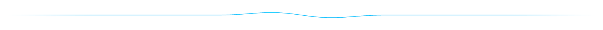
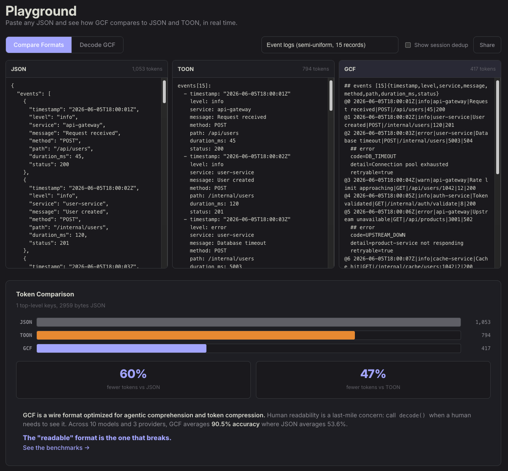

<p align="center">
  <a href="https://gcformat.com/playground.html"></a>
  <a href="https://gcformat.com/guide/benchmarks.html"></a>
  <a href="https://github.com/blackwell-systems/gcf"></a>
  <a href="LICENSE"></a>
</p>

<p align="center">
  
</p>

<h3 align="center">The AI-native wire format for structured data. Built for the agentic loop.</h3>

<p align="center">
  
</p>

> [!IMPORTANT]
> **GCF: A Token-Optimized Wire Format for Structured LLM Interactions**
> Dayna Blackwell, 2026. DOI: [10.5281/zenodo.20579817](https://doi.org/10.5281/zenodo.20579817)
>
> **Tokenizer-Attention Coupling: How BPE Merge Decisions Permanently Shape Transformer Internal Organization**
> Dayna Blackwell, 2026. DOI: [10.5281/zenodo.20925910](https://doi.org/10.5281/zenodo.20925910)
>
> **Stranded Attention: BPE Tokenization Permanently Constrains Transformer Structural Capacity**
> Dayna Blackwell, 2026. DOI: [10.5281/zenodo.21158886](https://doi.org/10.5281/zenodo.21158886)
>
> **Developmental Atlas of Attention Head Specialization: Spacing, Stranding, and the Capacity Tax of BPE Tokenization**
> Dayna Blackwell, 2026. DOI: [10.5281/zenodo.21205389](https://doi.org/10.5281/zenodo.21205389)

<p align="center">
  
</p>

**GCF is built for the agentic loop, where the same structured context crosses the model boundary turn after turn.** A single payload is already 50-92% smaller than JSON. But GCF also deduplicates repeated structure across turns and sends only deltas when context changes, so by the 5th overlapping call each response costs 99% fewer tokens than the JSON equivalent, and a full 10-call session runs 94.4% cheaper than re-sending JSON every turn. Session dedup and delta both need local IDs and a multi-turn design: **neither JSON nor TOON can do this at all.**

- **100% comprehension on every frontier model**, zero training required. 91.2% on structurally complex code graphs, where TOON drops to 68.8% and JSON to 54.1%.
- **Proven lossless.** `decode(encode(value)) == value` for every structured value, verified across 43,000,000,000+ round-trips in 5 formats and 6 languages, with interop validated across 17 serialization formats. Zero runtime dependencies, in all six SDKs.
- **One codec for every format.** Encode JSON, YAML, TOML, CSV, or MessagePack to GCF; the model reads it natively with zero format instructions; `decode()` converts back to any of them. Your existing schemas and validators work on the decoded output unchanged.

No other single format is all four at once: **schema-free** (no `.proto`), **lossless**, **token-compact** (50-92% vs JSON), and **model-readable** with zero training. JSON is verbose, Protobuf needs a schema, MessagePack is binary, and TOON silently corrupts data (7.54% round-trip failure, 176,487 silent corruptions per 10M) and collapses on structured data (68.8% comprehension where GCF holds 91.2% and JSON 54.1%). GCF is designed at the tokenizer level: its pipe delimiter has a [0% merge rate with field names](https://gcformat.com/guide/tokenizer-analysis), while JSON's grammar symbols and TOON's tab are hardcoded as merged vocabulary entries in BPE tokenizers (TOON's tab merges with adjacent content on 32.91% of boundaries, the worst of any common separator, and JSON's quote on 8.17%), creating structural boundaries the model cannot recover.

```bash
pip install gcf-python                    # Python
npm install @blackwell-systems/gcf        # TypeScript
go get github.com/blackwell-systems/gcf-go  # Go
cargo add gcf                             # Rust
```

Or wrap any existing MCP server with zero code changes:

```bash
pip install gcf-proxy
```

<p align="center">
  
</p>

## Benchmarks

2,500+ LLM evaluations across 11 models, 4 providers, and 50+ independent test runs.

| | Generic Profile (500 orders) | Graph Profile (500 symbols) |
|---|---|---|
| **GCF** | **100%** on every frontier model | **91.2%** (10 models) |
| **TOON** | weakest format consistently | 68.8% |
| **JSON** | GCF avg >= JSON on every model | 54.1% |

| | GCF | TOON | JSON |
|---|---|---|---|
| **Token efficiency** (16 datasets) | **wins 15/16** | wins 1/16 | wins 0/16 |
| **Generation** (28 runs, 11 models) | **5/5** | 1.0/5 | 5.0/5 |
| **Token savings** | **50-92%** vs JSON | 30-60% vs JSON | baseline |
| **43,000,000,000+ round-trips** | **0 failures** | | |

Full results: [gcformat.com/guide/benchmarks](https://gcformat.com/guide/benchmarks.html)

### Encode any structured data (generic profile)

```python
from gcf import encode_generic

output = encode_generic({
    "employees": [
        {"id": 1, "name": "Alice", "department": "Engineering", "salary": 95000},
        {"id": 2, "name": "Bob", "department": "Sales", "salary": 72000},
        {"id": 3, "name": "Carol", "department": "Marketing", "salary": 85000},
    ],
})
```

```
GCF profile=generic
## employees [3]{id,name,department,salary}
1|Alice|Engineering|95000
2|Bob|Sales|72000
3|Carol|Marketing|85000
```

One header declares field names. Rows are positional values only. No field names repeated per record. Lossless: `decode(encode(value)) == value` for every structured value, proven across 43,000,000,000+ random round-trips in 5 formats and 6 languages.

### Graph profile (code intelligence, knowledge graphs, MCP tools)

For data with nodes, edges, and distance groups:

```python
from gcf import encode, Payload, Symbol, Edge

output = encode(Payload(
    tool="context_for_task", token_budget=5000, tokens_used=1847,
    symbols=[
        Symbol(qualified_name="github.com/org/repo/pkg.AuthMiddleware", kind="function", score=0.78, provenance="lsp_resolved", distance=0),
        Symbol(qualified_name="github.com/org/repo/pkg.NewServer", kind="function", score=0.54, provenance="lsp_resolved", distance=1),
    ],
    edges=[Edge(source="github.com/org/repo/pkg.NewServer", target="github.com/org/repo/pkg.AuthMiddleware", edge_type="calls")],
))
```

```
GCF profile=graph tool=context_for_task budget=5000 tokens=1847 symbols=2 edges=1
## targets
@0 fn github.com/org/repo/pkg.AuthMiddleware 0.78 lsp_resolved
## related
@1 fn github.com/org/repo/pkg.NewServer 0.54 lsp_resolved
## edges [1]
@0<@1 calls
```

Local IDs (`@0`, `@1`) replace full names in edges. 81 tokens instead of 191 for JSON.

[](https://gcformat.com/playground.html)

**[Try it live in the playground](https://gcformat.com/playground.html)** with real-time multi-format comparison. Paste JSON, YAML, or TOML. Encode from and decode to JSON, YAML, TOML, CSV, and MessagePack.

## How it works

### Generic profile

Lossless structured data encoding. Arrays, nested objects, mixed types, primitives, root scalars. Works on any data that deserializes to objects and arrays, regardless of source format.

1. **Arrays of objects.** `## name [count]{field1,field2}` declares field names once. Rows are pipe-separated values. Absent fields use `~`, null uses `-`.
2. **Nested objects.** Fixed-shape nested objects are flattened into `>` path columns: `"customer>name"` becomes a column, values go directly in the row. 20-48% fewer tokens on deeply nested API data. Variable-length arrays and irregular shapes use `^` attachment fallback.
3. **Primitive arrays.** Inlined: `tags[2]: admin,user`. Strings containing commas are quoted.
4. **Scalars.** `key=value` at the top level. Strings that collide with typed literals (`"true"`, `"123"`, `"-"`) are quoted automatically.
5. **Root values.** Objects, arrays, and scalars at the document root. Every JSON value has a GCF representation.

### Graph profile

1. **Positional fields.** One header declares field names. Rows are values only.
2. **Local IDs.** `@0`, `@1`. Edges reference by ID, not by repeating full identifiers.
3. **Hierarchical grouping.** Section headers (`## targets`, `## related`) replace per-record metadata.

Both profiles share the same grammar (common scalar grammar, key grammar, header format). The savings are structural and grow with payload size.

### Streaming

Emit a payload incrementally, without buffering it, for database cursors, pagination, and graph traversals too large to hold in memory.

1. **Deferred counts.** A header emits `[?]` when the size isn't known yet (`## edges [?]`) and rows stream out as they are produced.
2. **Summary trailer.** A closing `##! summary symbols=8 edges=6 counts=2,1,3` backfills the real counts once the stream ends, so the model still gets exact totals.
3. **O(1) memory.** The encoder holds one row at a time; a 10,000-row cursor streams in constant memory instead of materializing the whole response.

TOON's tabular header requires the row count up front, so it must buffer the full array before the first byte; GCF defers the count and fills it in at the end.

## It gets cheaper over time

**Session deduplication:** Symbols sent in prior responses become bare references (`@7` = 2 tokens vs 19 for full declaration). At production scale (500 symbols), session dedup alone cuts 86.3% by call 5; composed with delta, 99.0% per call. A 10-call session reaches 94.4% cumulative savings vs JSON (each response costs 171 tokens vs 29,072 for JSON).

**Delta encoding:** When the context changes slightly between queries, send only the diff. 81.2% additional savings on re-queries.

No other format has these. They compound across multi-turn agent interactions.

## Implementations

| Language | Package | Repository |
|----------|---------|-----------|
| Go | `go get github.com/blackwell-systems/gcf-go` | [gcf-go](https://github.com/blackwell-systems/gcf-go) |
| TypeScript | `npm install @blackwell-systems/gcf` | [gcf-typescript](https://github.com/blackwell-systems/gcf-typescript) |
| Python | `pip install gcf-python` | [gcf-python](https://github.com/blackwell-systems/gcf-python) |
| Rust | `cargo add gcf` | [gcf-rust](https://github.com/blackwell-systems/gcf-rust) |
| Swift | Swift Package Manager | [gcf-swift](https://github.com/blackwell-systems/gcf-swift) |
| Kotlin | JitPack | [gcf-kotlin](https://github.com/blackwell-systems/gcf-kotlin) |
| MCP Proxy | `pip install gcf-proxy` | [gcf-proxy](https://github.com/blackwell-systems/gcf-proxy) (bidirectional, session dedup, HTTP frontend) |
| Claude Code Plugin | `/plugin install` | [gcf-claude-plugin](https://github.com/blackwell-systems/gcf-claude-plugin) (one-command install, session stats hook) |
| Codex Plugin | `codex plugin add` | [gcf-codex-plugin](https://github.com/blackwell-systems/gcf-codex-plugin) (one-command install, session stats hook) |
| VS Code | `ext install blackwell-systems.gcf-vscode` | [gcf-vscode](https://marketplace.visualstudio.com/items?itemName=blackwell-systems.gcf-vscode) (syntax highlighting) |
| n8n | `npm install n8n-nodes-gcf` | [gcf-n8n-nodes](https://github.com/blackwell-systems/gcf-n8n-nodes) (workflow encode/decode) |
| JetBrains | Search "GCF" in Plugins | [gcf-jetbrains](https://github.com/blackwell-systems/gcf-jetbrains) (IntelliJ, PyCharm, WebStorm, GoLand) |
| Zed | Search "GCF" in Extensions | [gcf-zed](https://github.com/blackwell-systems/gcf-zed) (tree-sitter syntax highlighting) |
| Tree-sitter | `npm install tree-sitter-gcf` | [tree-sitter-gcf](https://github.com/blackwell-systems/tree-sitter-gcf) |

**Zero runtime dependencies. Permanently.** All six implementations depend only on their language's standard library. No transitive dependencies. No supply chain risk. This is a permanent commitment: GCF will never take on external runtime dependencies. MIT licensed. All implementations support both generic profile (`encodeGeneric`) and graph profile (`encode`). CLI included in all 6 languages. Syntax highlighting via tree-sitter (Neovim, Helix, Zed).

**Specification:** [SPEC v3.4.1 Stable](SPEC.md) with 204 conformance fixtures, 43,000,000,000+ lossless round-trips verified across 5 formats and 6 languages. All implementations at v2.4.0+ (Go v1.5.0). Cross-language 6x6 matrix verified.

## Documentation

**[gcformat.com](https://gcformat.com/)**

- [Getting Started](https://gcformat.com/guide/getting-started.html)
- [Benchmarks](https://gcformat.com/guide/benchmarks.html)
- [Benchmarks (Full Data)](https://gcformat.com/guide/eval-results.html)
- [GCF vs TOON](https://gcformat.com/guide/vs-toon.html)
- [Schema Validation](https://gcformat.com/guide/schema-validation.html)
- [FAQ](https://gcformat.com/guide/faq.html)
- [Tokenizer Analysis](https://gcformat.com/guide/tokenizer-analysis.html) (why JSON's grammar breaks at the BPE level)
- [GCF on Small Models](https://gcformat.com/guide/small-models.html) (where the comprehension gap actually lives: cheap, local, and open-weight models)
- [Playground](https://gcformat.com/playground.html)
- [Specification](SPEC.md)

## Adopted by

[Chrome DevTools MCP](https://github.com/ChromeDevTools/chrome-devtools-mcp) (47K stars, Google Chrome DevTools team) · [Speakeasy](https://speakeasy.com) (API tooling, customers include Google, Verizon, Mistral AI, DocuSign, Vercel) · [OmniRoute](https://omniroute.online) (17K stars) · [NetClaw](https://github.com/automateyournetwork/netclaw) (610 stars) · [ctx](https://github.com/stevesolun/ctx) (552 stars) · [Lynkr](https://github.com/Fast-Editor/Lynkr) (531 stars, LLM gateway) · [NeuroNest](https://neuronest.cc) · [Open Data Products SDK](https://opendataproducts.org/sdk/) (Linux Foundation) · [Raycast](https://raycast.com/blackwell-systems/json-to-gcf-converter) · [and more](https://gcformat.com/ecosystem/adopters.html)

## Use cases

- **MCP tool responses.** Any MCP server returning structured data. 50-92% fewer tokens with 100% comprehension accuracy.
- **Agent-to-agent communication.** 63% fewer tokens per handoff. 5/5 generation validity on every frontier model.
- **LLM structured output.** LLMs produce valid GCF with a 3-line primer. No training required.
- **Code intelligence.** Graph profile with local IDs, edges, and distance grouping.
- **Multi-format interop.** Validated lossless across 17 serialization formats (JSON, XML, MessagePack, YAML, BSON, TOML, CBOR, Protobuf, CSV, JSON5, Avro, Arrow, Parquet, Pickle, INI, NDJSON, Plist).

<details>
<summary>More links</summary>

- [betterthanjson.com](https://betterthanjson.com)
- [jsonalternative.com](https://jsonalternative.com)
- [betterthantoon.com](https://betterthantoon.com)

</details>

## License

MIT - [Dayna Blackwell](https://github.com/blackwell-systems)
