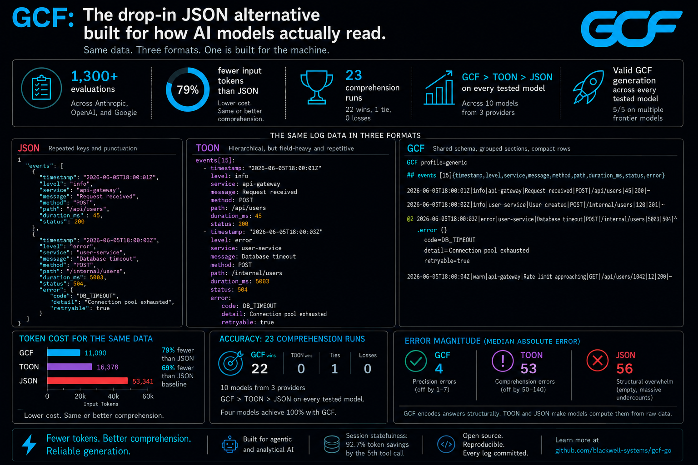

<p align="center">
  <a href="https://gcformat.com/playground.html"></a>
  <a href="https://gcformat.com/guide/benchmarks.html"></a>
  <a href="https://github.com/blackwell-systems/gcf"></a>
  <a href="LICENSE"></a>
</p>

<p align="center">
  
</p>

<h3 align="center">The AI-native wire format for structured data.</h3>

> [!IMPORTANT]
> **GCF: A Token-Optimized Wire Format for Structured LLM Interactions**
> Dayna Blackwell, 2026. DOI: [10.5281/zenodo.20579817](https://doi.org/10.5281/zenodo.20579817)
>
> **Structural Ambiguity in JSON Tokenization: A Cross-Tokenizer Analysis**
> Dayna Blackwell, 2026. DOI: [10.5281/zenodo.20789619](https://doi.org/10.5281/zenodo.20789619)

---

**100% comprehension on every frontier model. 50-92% fewer tokens than JSON. 91.2% on structurally complex code graphs (vs TOON 68.2%, JSON 53.4%). Proven lossless: `decode(encode(value)) == value` for every structured value, verified across 43,000,000,000+ round-trips in 5 formats and 17 serialization formats. Zero training required. JSON's grammar symbols are [hardcoded as merged vocabulary entries](https://gcformat.com/guide/tokenizer-analysis) in BPE tokenizers, creating irrecoverable structural boundaries. GCF's pipe delimiter has 0% merge rate with field names.**

Encode any structured data as GCF before sending it to an LLM. JSON, YAML, TOML, CSV, MessagePack: GCF encodes them all. The model reads it natively with zero format instructions. `decode()` converts back to any format when a human needs to see it. Your existing schemas and validators work on the decoded output unchanged.

```bash
pip install gcf-python                    # Python
npm install @blackwell-systems/gcf        # TypeScript
go get github.com/blackwell-systems/gcf-go  # Go
cargo add gcf                             # Rust
```

Or wrap any existing MCP server with zero code changes:

```bash
pip install gcf-proxy
```

---

## Benchmarks

2,400+ LLM evaluations across 11 models, 3 providers, and 50+ independent test runs.

| | Generic Profile (500 orders) | Graph Profile (500 symbols) |
|---|---|---|
| **GCF** | **100%** on every frontier model | **91.2%** (10 models) |
| **TOON** | weakest format consistently | 68.2% |
| **JSON** | GCF avg >= JSON on every model | 53.4% |

| | GCF | TOON | JSON |
|---|---|---|---|
| **Token efficiency** (16 datasets) | **wins 15/16** | wins 1/16 | wins 0/16 |
| **Generation** (28 runs, 11 models) | **5/5** | 1.0/5 | 5.0/5 |
| **Token savings** | **50-92%** vs JSON | 30-60% vs JSON | baseline |
| **43,000,000,000+ round-trips** | **0 failures** | | |

Full results: [gcformat.com/guide/benchmarks](https://gcformat.com/guide/benchmarks.html)

---

### Encode any structured data (generic profile)

```python
from gcf import encode_generic

output = encode_generic({
    "employees": [
        {"id": 1, "name": "Alice", "department": "Engineering", "salary": 95000},
        {"id": 2, "name": "Bob", "department": "Sales", "salary": 72000},
        {"id": 3, "name": "Carol", "department": "Marketing", "salary": 85000},
    ],
})
```

```
GCF profile=generic
## employees [3]{id,name,department,salary}
1|Alice|Engineering|95000
2|Bob|Sales|72000
3|Carol|Marketing|85000
```

One header declares field names. Rows are positional values only. No field names repeated per record. Lossless: `decode(encode(value)) == value` for every structured value, proven across 43,000,000,000+ random round-trips in 5 formats and 6 languages.

### Graph profile (code intelligence, knowledge graphs, MCP tools)

For data with nodes, edges, and distance groups:

```python
from gcf import encode, Payload, Symbol, Edge

output = encode(Payload(
    tool="context_for_task", token_budget=5000, tokens_used=1847,
    symbols=[
        Symbol(qualified_name="pkg.Auth", kind="function", score=0.78, provenance="lsp", distance=0),
        Symbol(qualified_name="pkg.Server", kind="function", score=0.54, provenance="lsp", distance=1),
    ],
    edges=[Edge(source="pkg.Server", target="pkg.Auth", edge_type="calls")],
))
```

```
GCF profile=graph tool=context_for_task budget=5000 tokens=1847 symbols=2 edges=1
## targets
@0 fn pkg.Auth 0.78 lsp
## related
@1 fn pkg.Server 0.54 lsp
## edges [1]
@0<@1 calls
```

Local IDs (`@0`, `@1`) replace full names in edges. 233 tokens instead of 965 for JSON.

[](https://gcformat.com/playground.html)

**[Try it live in the playground](https://gcformat.com/playground.html)** with real-time multi-format comparison. Paste JSON, YAML, or TOML. Encode from and decode to JSON, YAML, TOML, CSV, and MessagePack.

---

## How it works

### Generic profile

Lossless structured data encoding. Arrays, nested objects, mixed types, primitives, root scalars. Works on any data that deserializes to objects and arrays, regardless of source format.

1. **Arrays of objects.** `## name [count]{field1,field2}` declares field names once. Rows are pipe-separated values. Absent fields use `~`, null uses `-`.
2. **Nested objects.** Fixed-shape nested objects are flattened into `>` path columns: `"customer>name"` becomes a column, values go directly in the row. 20-48% fewer tokens on deeply nested API data. Variable-length arrays and irregular shapes use `^` attachment fallback.
3. **Primitive arrays.** Inlined: `tags[2]: admin,user`. Strings containing commas are quoted.
4. **Scalars.** `key=value` at the top level. Strings that collide with typed literals (`"true"`, `"123"`, `"-"`) are quoted automatically.
5. **Root values.** Objects, arrays, and scalars at the document root. Every JSON value has a GCF representation.

### Graph profile

1. **Positional fields.** One header declares field names. Rows are values only.
2. **Local IDs.** `@0`, `@1`. Edges reference by ID, not by repeating full identifiers.
3. **Hierarchical grouping.** Section headers (`## targets`, `## related`) replace per-record metadata.

Both profiles share the same grammar (common scalar grammar, key grammar, header format). The savings are structural and grow with payload size.

## It gets cheaper over time

**Session deduplication:** Symbols sent in prior responses become bare references (`@7` = 2 tokens vs 19 for full declaration). Over a 5-call session at production scale (500 symbols): 84.3% cumulative savings vs JSON (148K JSON tokens vs 23K GCF). By call 5: 91.9% savings.

**Delta encoding:** When the context changes slightly between queries, send only the diff. 81.2% additional savings on re-queries.

No other format has these. They compound across multi-turn agent interactions.

## Implementations

| Language | Package | Repository |
|----------|---------|-----------|
| Go | `go get github.com/blackwell-systems/gcf-go` | [gcf-go](https://github.com/blackwell-systems/gcf-go) |
| TypeScript | `npm install @blackwell-systems/gcf` | [gcf-typescript](https://github.com/blackwell-systems/gcf-typescript) |
| Python | `pip install gcf-python` | [gcf-python](https://github.com/blackwell-systems/gcf-python) |
| Rust | `cargo add gcf` | [gcf-rust](https://github.com/blackwell-systems/gcf-rust) |
| Swift | Swift Package Manager | [gcf-swift](https://github.com/blackwell-systems/gcf-swift) |
| Kotlin | JitPack | [gcf-kotlin](https://github.com/blackwell-systems/gcf-kotlin) |
| MCP Proxy | `pip install gcf-proxy` | [gcf-proxy](https://github.com/blackwell-systems/gcf-proxy) (bidirectional, session dedup, HTTP frontend) |
| Claude Code Plugin | `/plugin install` | [gcf-claude-plugin](https://github.com/blackwell-systems/gcf-claude-plugin) (one-command install, session stats hook) |
| Codex Plugin | `codex plugin add` | [gcf-codex-plugin](https://github.com/blackwell-systems/gcf-codex-plugin) (one-command install, session stats hook) |
| VS Code | `ext install blackwell-systems.gcf-vscode` | [gcf-vscode](https://marketplace.visualstudio.com/items?itemName=blackwell-systems.gcf-vscode) (syntax highlighting) |
| n8n | `npm install n8n-nodes-gcf` | [gcf-n8n-nodes](https://github.com/blackwell-systems/gcf-n8n-nodes) (workflow encode/decode) |
| JetBrains | Search "GCF" in Plugins | [gcf-jetbrains](https://github.com/blackwell-systems/gcf-jetbrains) (IntelliJ, PyCharm, WebStorm, GoLand) |
| Zed | Search "GCF" in Extensions | [gcf-zed](https://github.com/blackwell-systems/gcf-zed) (tree-sitter syntax highlighting) |
| Tree-sitter | `npm install tree-sitter-gcf` | [tree-sitter-gcf](https://github.com/blackwell-systems/tree-sitter-gcf) |

**Zero runtime dependencies. Permanently.** All six implementations depend only on their language's standard library. No transitive dependencies. No supply chain risk. This is a permanent commitment: GCF will never take on external runtime dependencies. MIT licensed. All implementations support both generic profile (`encodeGeneric`) and graph profile (`encode`). CLI included in all 6 languages. Syntax highlighting via tree-sitter (Neovim, Helix, Zed).

**Specification:** [SPEC v3.2 Stable](SPEC.md) with 173 conformance fixtures, 43,000,000,000+ lossless round-trips verified across 5 formats and 6 languages. All implementations at v2.2.0+ (Go v1.3.0). Cross-language 6x6 matrix verified.

## Documentation

**[gcformat.com](https://gcformat.com/)**

- [Getting Started](https://gcformat.com/guide/getting-started.html)
- [Benchmarks](https://gcformat.com/guide/benchmarks.html)
- [Benchmarks (Full Data)](https://gcformat.com/guide/eval-results.html)
- [GCF vs TOON](https://gcformat.com/guide/vs-toon.html)
- [Schema Validation](https://gcformat.com/guide/schema-validation.html)
- [FAQ](https://gcformat.com/guide/faq.html)
- [Tokenizer Analysis](https://gcformat.com/guide/tokenizer-analysis.html) (why JSON's grammar breaks at the BPE level)
- [Independent AI Reviews](https://gcformat.com/reviews/)
- [Playground](https://gcformat.com/playground.html)
- [Specification](SPEC.md)

## Adopted by

[Speakeasy](https://speakeasy.com) (API tooling, customers include Google, Verizon, Mistral AI, DocuSign, Vercel) · [OmniRoute](https://omniroute.online) (6.1K stars) · [NetClaw](https://github.com/automateyournetwork/netclaw) (556 stars) · [ctx](https://github.com/stevesolun/ctx) (510 stars) · [NeuroNest](https://neuronest.cc) · [Open Data Products SDK](https://opendataproducts.org/sdk/) (Linux Foundation) · [Raycast](https://raycast.com/blackwell-systems/json-to-gcf-converter) · [and more](https://gcformat.com/ecosystem/adopters.html)

## Use cases

- **MCP tool responses.** Any MCP server returning structured data. 50-92% fewer tokens with 100% comprehension accuracy.
- **Agent-to-agent communication.** 63% fewer tokens per handoff. 5/5 generation validity on every frontier model.
- **LLM structured output.** LLMs produce valid GCF with a 3-line primer. No training required.
- **Code intelligence.** Graph profile with local IDs, edges, and distance grouping.
- **Multi-format interop.** Validated lossless across 17 serialization formats (JSON, XML, MessagePack, YAML, BSON, TOML, CBOR, Protobuf, CSV, JSON5, Avro, Arrow, Parquet, Pickle, INI, NDJSON, Plist).

<details>
<summary>More links</summary>

- [betterthanjson.com](https://betterthanjson.com)
- [jsonalternative.com](https://jsonalternative.com)
- [betterthantoon.com](https://betterthantoon.com)

</details>

## License

MIT - [Dayna Blackwell](https://github.com/blackwell-systems)
