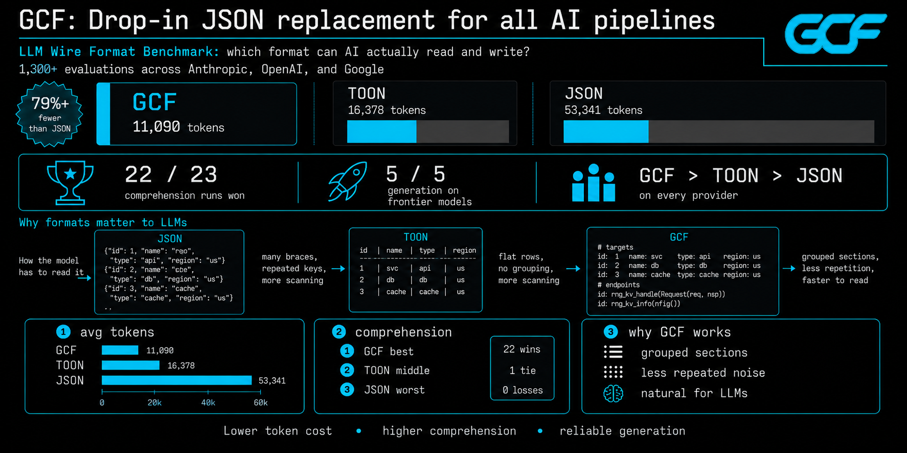
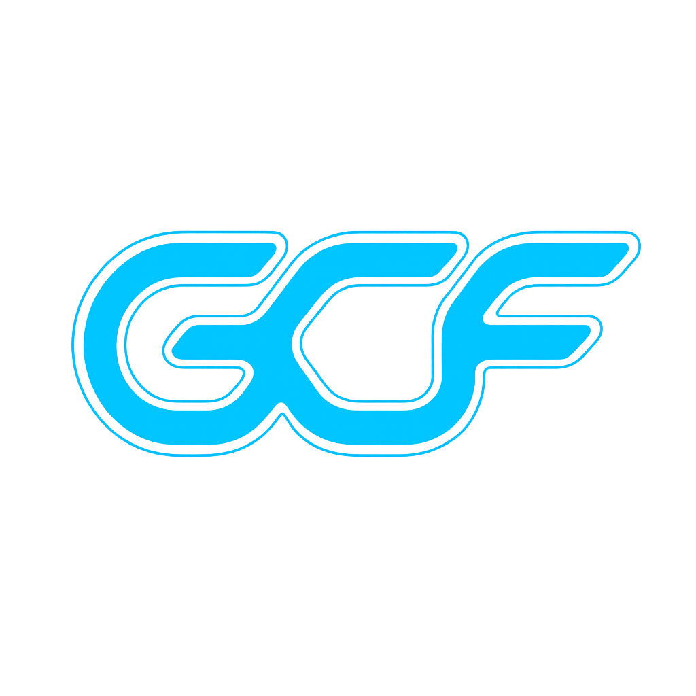

<p align="center">
  <a href="https://gcformat.com/playground.html"></a>
  <a href="https://gcformat.com/guide/benchmarks.html"></a>
  <a href="https://github.com/blackwell-systems/gcf"></a>
  <a href="LICENSE"></a>
</p>

<p align="center">
  
</p>

<h3 align="center">Drop-in JSON replacement for all AI pipelines, with superpowers for graph-shaped data.</h3>

---

**79% fewer input tokens than JSON. 63% fewer output tokens. 90.5% average comprehension accuracy across 10 models and 3 providers (four models hit 100%). 1,300+ LLM evaluations. Zero training.**

Encode any JSON payload as GCF before sending it to an LLM. Arrays, nested objects, key-value pairs, mixed types. The model reads it natively with zero format instructions. `decode()` converts back to JSON when a human needs to see it.

```
pip install gcf-proxy    # wrap any MCP server, zero code changes
```

---

## Benchmarks

1,300+ LLM evaluations across 10 models, 3 providers, and 51 independent test runs.

| | GCF | TOON | JSON |
|---|---|---|---|
| **Comprehension** (23 runs, 10 models) | **90.5%** | 68.5% | 53.6% |
| **Generation** (28 runs, 9 models) | **5/5** | 1.0/5 | 5.0/5 |
| **Input tokens** (500 symbols) | **11,090** | 16,378 | 53,341 |
| **Output tokens** (100 symbols) | **5,976** | 8,937 | 16,121 |

GCF wins all 6 datasets on [TOON's own benchmark](https://github.com/blackwell-systems/toon/tree/gcf-comparison). Full results: [gcformat.com/guide/benchmarks](https://gcformat.com/guide/benchmarks.html)

---

## Try it

```bash
pip install gcf-python                    # Python
npm install @blackwell-systems/gcf        # TypeScript
go get github.com/blackwell-systems/gcf-go  # Go
cargo add gcf                             # Rust
```

### Encode any structured data (generic profile)

```python
from gcf import encode_generic

output = encode_generic({
    "employees": [
        {"id": 1, "name": "Alice", "department": "Engineering", "salary": 95000},
        {"id": 2, "name": "Bob", "department": "Sales", "salary": 72000},
        {"id": 3, "name": "Carol", "department": "Marketing", "salary": 85000},
    ],
})
```

```
## employees [3]{id,name,department,salary}
1|Alice|Engineering|95000
2|Bob|Sales|72000
3|Carol|Marketing|85000
```

One header declares field names. Rows are positional values only. No field names repeated per record. Works on any JSON.

### Graph profile (code intelligence, knowledge graphs, MCP tools)

For data with nodes, edges, and distance groups:

```python
from gcf import encode, Payload, Symbol, Edge

output = encode(Payload(
    tool="context_for_task", token_budget=5000, tokens_used=1847,
    symbols=[
        Symbol(qualified_name="pkg.Auth", kind="function", score=0.78, provenance="lsp", distance=0),
        Symbol(qualified_name="pkg.Server", kind="function", score=0.54, provenance="lsp", distance=1),
    ],
    edges=[Edge(source="pkg.Server", target="pkg.Auth", edge_type="calls")],
))
```

```
GCF tool=context_for_task budget=5000 tokens=1847 symbols=2 edges=1
## targets
@0 fn pkg.Auth 0.78 lsp
## related
@1 fn pkg.Server 0.54 lsp
## edges [1]
@0<@1 calls
```

Local IDs (`@0`, `@1`) replace full names in edges. 233 tokens instead of 965 for JSON.

**[Try it live in the playground](https://gcformat.com/playground.html)** with real-time three-way comparison (JSON vs TOON vs GCF).

---

## How it works

### Generic profile

1. **Tabular headers.** `## name [count]{field1,field2}` declares field names once. Rows are pipe-separated values.
2. **Section headers.** `## key` for nested objects. `key=value` for primitives.

### Graph profile

1. **Positional fields.** One header declares field names. Rows are values only.
2. **Local IDs.** `@0`, `@1`. Edges reference by ID, not by repeating full identifiers.
3. **Hierarchical grouping.** Section headers (`## targets`, `## related`) replace per-record metadata.

Both profiles share the same grammar. The savings are structural and grow with payload size.

## It gets cheaper over time

**Session deduplication:** Symbols sent in prior responses become bare references. By the 5th tool call: 92.7% savings vs JSON.

**Delta encoding:** When the context changes slightly between queries, send only the diff. 81.2% additional savings on re-queries.

No other format has these. They compound across multi-turn agent interactions.

## Implementations

| Language | Package | Repository |
|----------|---------|-----------|
| Go | `go get github.com/blackwell-systems/gcf-go` | [gcf-go](https://github.com/blackwell-systems/gcf-go) |
| TypeScript | `npm install @blackwell-systems/gcf` | [gcf-typescript](https://github.com/blackwell-systems/gcf-typescript) |
| Python | `pip install gcf-python` | [gcf-python](https://github.com/blackwell-systems/gcf-python) |
| Rust | `cargo add gcf` | [gcf-rust](https://github.com/blackwell-systems/gcf-rust) |
| Swift | Swift Package Manager | [gcf-swift](https://github.com/blackwell-systems/gcf-swift) |
| Kotlin | JitPack | [gcf-kotlin](https://github.com/blackwell-systems/gcf-kotlin) |
| MCP Proxy | `pip install gcf-proxy` | [gcf-proxy](https://github.com/blackwell-systems/gcf-proxy) |
| Tree-sitter | `npm install tree-sitter-gcf` | [tree-sitter-gcf](https://github.com/blackwell-systems/tree-sitter-gcf) |

Zero runtime dependencies. MIT licensed. All implementations support both generic profile (`encodeGeneric`) and graph profile (`encode`). CLI included in Go, TypeScript, and Python. Syntax highlighting via tree-sitter (Neovim, Helix, Zed).

## Documentation

**[gcformat.com](https://gcformat.com/)**

- [Getting Started](https://gcformat.com/guide/getting-started.html)
- [Benchmarks](https://gcformat.com/guide/benchmarks.html)
- [Benchmarks (Full Data)](https://gcformat.com/guide/eval-results.html)
- [GCF vs TOON](https://gcformat.com/guide/vs-toon.html)
- [Playground](https://gcformat.com/playground.html)
- [Specification](SPEC.md)

## Use cases

- **MCP tool responses.** Any MCP server returning structured data. 79% fewer tokens with better comprehension accuracy.
- **Agent-to-agent communication.** 63% fewer tokens per handoff. 5/5 generation validity on every frontier model.
- **LLM structured output.** LLMs produce valid GCF with a 3-line primer. No training required.
- **Code intelligence.** Graph profile with local IDs, edges, and distance grouping.

## License

MIT
