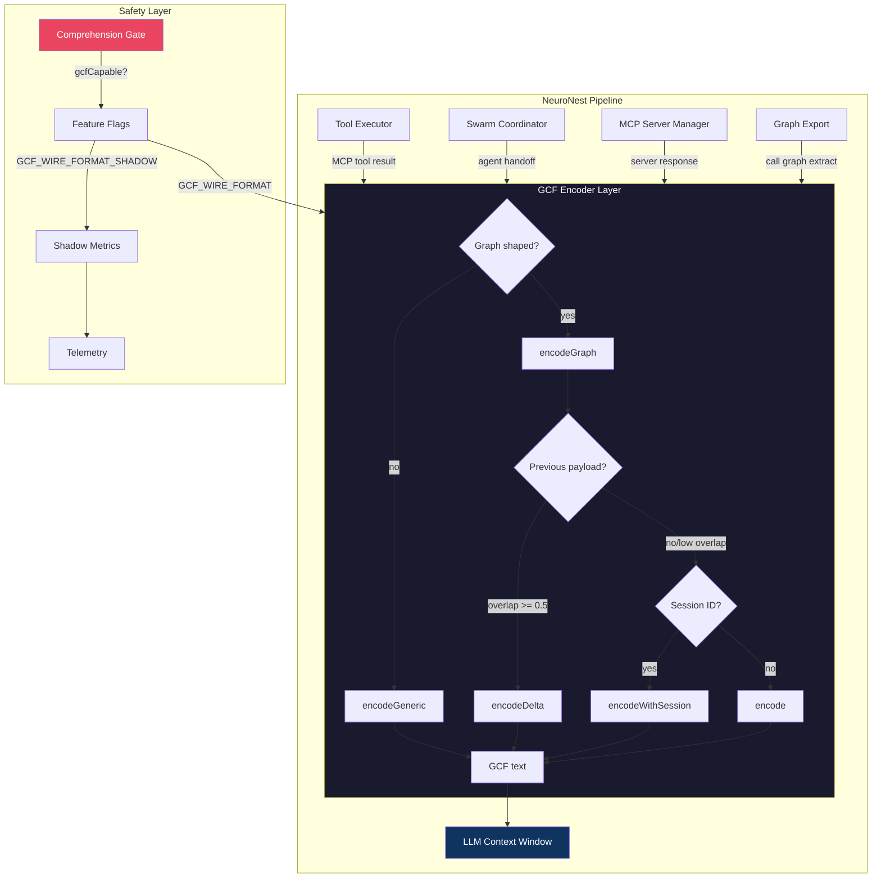

# Case Study: NeuroNest

**[NeuroNest](https://github.com/NETGVai/NeuroNest)** is an agent-first IDE built by [Network Guardian](https://netgv.ai). It is the first independent commercial adoption of GCF.

## Integration scope

GCF is integrated across four encoding surfaces in the NeuroNest pipeline:

| Surface | Encoder | Description |
|---------|---------|-------------|
| Tool executor | `encodeGeneric` | MCP tool responses encoded before feeding to LLM |
| Swarm coordinator | `encodeGraph` / `encodeGeneric` | Agent-to-agent handoffs in multi-agent workflows |
| MCP server manager | `encodeGraph` / `encodeGeneric` | Server response encoding with shape detection |
| Graph export (indexing) | `encodeGraph` | Call graph extracts for code intelligence queries |

Each surface auto-detects whether the data is graph-shaped (has `tool` + `symbols` + `edges`) and routes to the graph or generic encoder accordingly.

## Production-grade engineering

NeuroNest's GCF integration goes well beyond basic encoding:

### Session dedup with eviction
Per-conversation `Session` objects track transmitted symbols. Bare references replace full declarations on subsequent calls. Sessions evict after 1 hour of inactivity via both lazy sweep (on access) and a background timer.

### Delta encoding with Jaccard similarity
When a caller supplies a previous payload, the encoder computes the Jaccard similarity of the two symbol sets (by qualified name). At >= 0.5 overlap, it emits a delta-only encoding of the changes. Below 0.5, it sends a full encode. The diff is purely deterministic: no internal cache, no side effects.

### Per-provider comprehension gate
Before flipping any provider from JSON to GCF, NeuroNest runs a built-in comprehension eval. A fixed reference graph payload (symbols, edges, distance groups) is shown to the provider encoded as both JSON and GCF. Structured-extraction questions probe whether the model can read the format: symbol counts, edge types, distance grouping, qualified name extraction.

Each question is scored by substring match against a known answer. The provider is marked `gcfCapable: true` only when GCF accuracy is within 5 percentage points of the JSON baseline. Results persist to `~/.neuronest/gcf-capabilities.json` with a timestamp, so re-evaluation can be triggered when providers update their models.

The rollout banner in the settings UI stays locked (yellow warning) until every currently-configured provider passes the gate. This prevents enabling GCF for a provider that hasn't proven it can read the format, eliminating the risk of degraded comprehension in production.

### Shadow mode (A/B testing)
Two feature flags control rollout:
- `GCF_WIRE_FORMAT=true`: active mode, LLM receives GCF
- `GCF_WIRE_FORMAT=false` + `GCF_WIRE_FORMAT_SHADOW=true`: shadow mode, GCF is computed for telemetry but JSON is sent to the LLM

Shadow mode emits `gcf.shadow_savings_ratio` metrics so the team can measure token savings before committing to the format switch.

### Non-throwing failure contract
`encodeGraph` and `encodeGeneric` never throw. Any error returns `null`, and callers fall back to JSON deterministically. This means GCF can never crash the pipeline.

### LLM primer
A `GCF_PRIMER` constant is exported and injected into the system prompt when GCF is active:

> GCF format: header starts with "GCF profile=graph tool=", symbols are @id kind qname score provenance, edges are @target<@source type (< not >), sections are ## targets/related/extended/edges.

### Metrics
Per-surface savings ratios are emitted as telemetry: `gcf.tool_executor.savings_ratio`, `gcf.indexing.savings_ratio`, etc.

## Architecture

## Technical details

- Library: `@blackwell-systems/gcf` v1.0.0
- Content hashing: FNV-1a for delta `baseRoot`/`newRoot` (self-consistent; the spec's SHA-256 `PackRoot` would enable cross-implementation delta verification)

### ESM compatibility shim
`@blackwell-systems/gcf` is published as ESM-only. NeuroNest's Electron main process runs CommonJS, which cannot `require()` an ESM package. Their solution: a `Function('s', 'return import(s)')` wrapper that survives TypeScript compilation as a genuine dynamic `import()` (tsc never rewrites string contents inside `Function`). The bindings are loaded lazily at boot via `initGcf()` and cached on `globalThis` so every module instance shares the same loaded library. Until initialization completes, all encode calls return `null` and callers fall back to JSON. This pattern is reusable by any Electron app integrating an ESM-only dependency.

## Key takeaway

NeuroNest didn't just add GCF as an encoding step. They built a complete rollout framework around it: comprehension gates, shadow mode, per-surface metrics, session management, and delta encoding. This is what production adoption of a wire format looks like.
