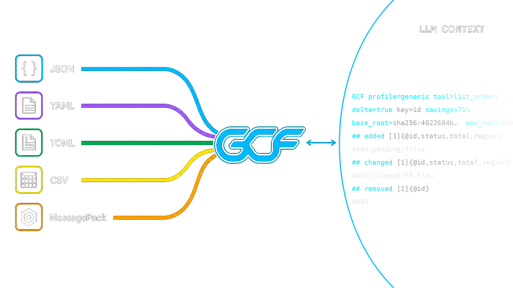
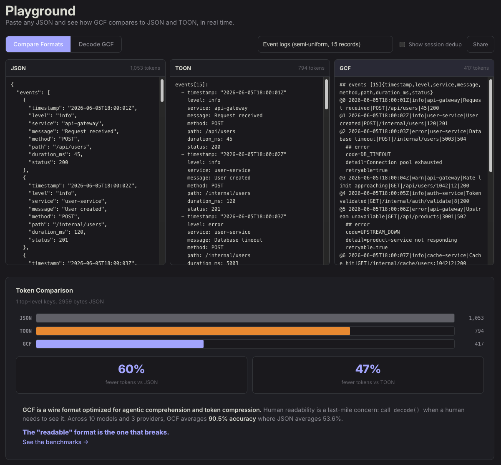

[English](../../README.md) · [简体中文](README.zh-CN.md) · **Русский** · [हिन्दी](README.hi.md) · [العربية](README.ar.md)

<p align="center">
  <a href="https://gcformat.com/playground.html"></a>
  <a href="https://gcformat.com/guide/benchmarks.html"></a>
  <a href="https://github.com/blackwell-systems/gcf"></a>
  <a href="../../LICENSE"></a>
</p>

<p align="center">
  
</p>

<h3 align="center">AI-нативный формат передачи структурированных данных. Создан для агентного цикла.</h3>

<p align="center">
  
</p>

> [!IMPORTANT]
> **Восстановлен методом обратной разработки из оригинального исследования механизмов внимания.** Четыре статьи Dayna Blackwell (2026, на рецензировании):
> - [GCF: A Token-Optimized Wire Format for Structured LLM Interactions](https://doi.org/10.5281/zenodo.20579817)
> - [Tokenizer-Attention Coupling: How BPE Merge Decisions Permanently Shape Transformer Internal Organization](https://doi.org/10.5281/zenodo.20925910)
> - [Stranded Attention: BPE Tokenization Permanently Constrains Transformer Structural Capacity](https://doi.org/10.5281/zenodo.21158886)
> - [Developmental Atlas of Attention Head Specialization: Spacing, Stranding, and the Capacity Tax of BPE Tokenization](https://doi.org/10.5281/zenodo.21205389)

<p align="center">
  
</p>

**GCF создан для агентного цикла, в котором один и тот же структурированный контекст пересекает границу модели раз за разом.** Одна полезная нагрузка уже на 50-92% меньше, чем JSON. Но GCF также дедуплицирует повторяющуюся структуру между ходами и отправляет только дельты при изменении контекста, так что к 5-му перекрывающемуся вызову каждый ответ стоит на 99% меньше токенов, чем эквивалент на JSON, а полная сессия из 10 вызовов обходится на 94,4% дешевле повторной отправки JSON на каждом ходу. И дедупликация сессии, и дельта требуют локальных ID и многоходовой архитектуры: **ни JSON, ни TOON не способны на это вовсе.**

- **100% понимания на каждой передовой модели**, без какого-либо обучения. 91,2% на структурно сложных графах кода, где TOON падает до 68,8%, а JSON до 54,1%.
- **Доказанная безошибочность.** `decode(encode(value)) == value` для каждого структурированного значения, проверено на 43 000 000 000+ циклов туда-обратно в 5 форматах и 6 языках, с подтверждённой совместимостью между 17 форматами сериализации. Нулевые зависимости во время выполнения — во всех семи SDK.
- **Один кодек для любого формата.** Кодируйте JSON, YAML, TOML, CSV или MessagePack в GCF; модель читает его нативно без каких-либо инструкций по формату; `decode()` конвертирует обратно в любой из них. Ваши существующие схемы и валидаторы работают с декодированным выводом без изменений.

Ни один другой отдельный формат не обладает всеми четырьмя свойствами сразу: **без схемы** (без `.proto`), **безошибочный**, **компактный по токенам** (50-92% против JSON) и **читаемый моделью** без обучения. JSON многословен, Protobuf требует схемы, MessagePack бинарен, а TOON молча повреждает данные (7,54% отказов при цикле туда-обратно, 176 487 тихих повреждений на 10 млн) и разваливается на структурированных данных (68,8% понимания там, где GCF держит 91,2%, а JSON 54,1%). GCF спроектирован на уровне токенизатора: его разделитель-вертикальная черта имеет [нулевую частоту слияния с именами полей](https://gcformat.com/guide/tokenizer-analysis), тогда как грамматические символы JSON и табуляция TOON жёстко закодированы как слитые словарные записи в BPE-токенизаторах (табуляция TOON сливается с соседним содержимым на 32,91% границ — худший показатель среди всех распространённых разделителей, а кавычка JSON — на 8,17%), создавая структурные границы, которые модель не может восстановить.

```bash
pip install gcf-python                    # Python
npm install @blackwell-systems/gcf        # TypeScript
go get github.com/blackwell-systems/gcf-go  # Go
cargo add gcf                             # Rust
dotnet add package BlackwellSystems.Gcf   # .NET
```

Или оберните любой существующий MCP server без единого изменения кода:

```bash
pip install gcf-proxy
```

<p align="center">
  
</p>

## Бенчмарки

2 500+ оценок LLM на 11 моделях, 4 провайдерах и 50+ независимых тестовых прогонах.

| | Generic-профиль (500 заказов) | Graph-профиль (500 символов) |
|---|---|---|
| **GCF** | **100%** на каждой передовой модели | **91,2%** (10 моделей) |
| **TOON** | стабильно самый слабый формат | 68,8% |
| **JSON** | среднее GCF >= JSON на каждой модели | 54,1% |

| | GCF | TOON | JSON |
|---|---|---|---|
| **Эффективность по токенам** (16 наборов данных) | **побеждает в 15/16** | побеждает в 1/16 | побеждает в 0/16 |
| **Генерация** (28 прогонов, 11 моделей) | **5/5** | 1,0/5 | 5,0/5 |
| **Экономия токенов** | **50-92%** против JSON | 30-60% против JSON | базовый уровень |
| **43 000 000 000+ циклов туда-обратно** | **0 отказов** | | |

Полные результаты: [gcformat.com/guide/benchmarks](https://gcformat.com/guide/benchmarks.html)

### Кодирование любых структурированных данных (generic-профиль)

```python
from gcf import encode_generic

output = encode_generic({
    "employees": [
        {"id": 1, "name": "Alice", "department": "Engineering", "salary": 95000},
        {"id": 2, "name": "Bob", "department": "Sales", "salary": 72000},
        {"id": 3, "name": "Carol", "department": "Marketing", "salary": 85000},
    ],
})
```

```
GCF profile=generic
## employees [3]{id,name,department,salary}
1|Alice|Engineering|95000
2|Bob|Sales|72000
3|Carol|Marketing|85000
```

Один заголовок объявляет имена полей. Строки — это только позиционные значения. Имена полей не повторяются в каждой записи. Безошибочно: `decode(encode(value)) == value` для каждого структурированного значения, доказано на 43 000 000 000+ случайных циклов туда-обратно в 5 форматах и 6 языках.

### Graph-профиль (интеллектуальный анализ кода, графы знаний, инструменты MCP)

Для данных с узлами, рёбрами и группами по расстоянию:

```python
from gcf import encode, Payload, Symbol, Edge

output = encode(Payload(
    tool="context_for_task", token_budget=5000, tokens_used=1847,
    symbols=[
        Symbol(qualified_name="github.com/org/repo/pkg.AuthMiddleware", kind="function", score=0.78, provenance="lsp_resolved", distance=0),
        Symbol(qualified_name="github.com/org/repo/pkg.NewServer", kind="function", score=0.54, provenance="lsp_resolved", distance=1),
    ],
    edges=[Edge(source="github.com/org/repo/pkg.NewServer", target="github.com/org/repo/pkg.AuthMiddleware", edge_type="calls")],
))
```

```
GCF profile=graph tool=context_for_task budget=5000 tokens=1847 symbols=2 edges=1
## targets
@0 fn github.com/org/repo/pkg.AuthMiddleware 0.78 lsp_resolved
## related
@1 fn github.com/org/repo/pkg.NewServer 0.54 lsp_resolved
## edges [1]
@0<@1 calls
```

Локальные ID (`@0`, `@1`) заменяют полные имена в рёбрах. 81 токен вместо 191 для JSON.

[](https://gcformat.com/playground.html)

**[Попробуйте вживую в playground](https://gcformat.com/playground.html)** с многоформатным сравнением в реальном времени. Вставьте JSON, YAML или TOML. Кодируйте из JSON, YAML, TOML, CSV и MessagePack и декодируйте обратно в них.

## Как это работает

### Generic-профиль

Безошибочное кодирование структурированных данных. Массивы, вложенные объекты, смешанные типы, примитивы, корневые скаляры. Работает с любыми данными, которые десериализуются в объекты и массивы, независимо от исходного формата.

1. **Массивы объектов.** `## name [count]{field1,field2}` объявляет имена полей один раз. Строки — значения, разделённые вертикальной чертой. Отсутствующие поля обозначаются `~`, null — `-`.
2. **Вложенные объекты.** Вложенные объекты фиксированной формы разворачиваются в столбцы-пути с `>`: `"customer>name"` становится столбцом, значения идут прямо в строку. На 20-48% меньше токенов на глубоко вложенных данных API. Массивы переменной длины и нерегулярные формы используют запасной механизм присоединения `^`.
3. **Массивы примитивов.** Встраиваются: `tags[2]: admin,user`. Строки, содержащие запятые, заключаются в кавычки.
4. **Скаляры.** `key=value` на верхнем уровне. Строки, которые сталкиваются с типизированными литералами (`"true"`, `"123"`, `"-"`), автоматически заключаются в кавычки.
5. **Корневые значения.** Объекты, массивы и скаляры в корне документа. Каждое значение JSON имеет представление в GCF.

### Graph-профиль

1. **Позиционные поля.** Один заголовок объявляет имена полей. Строки — только значения.
2. **Локальные ID.** `@0`, `@1`. Рёбра ссылаются по ID, а не повторяют полные идентификаторы.
3. **Иерархическая группировка.** Заголовки секций (`## targets`, `## related`) заменяют метаданные каждой записи.

Оба профиля разделяют одну и ту же грамматику (общая грамматика скаляров, грамматика ключей, формат заголовков). Экономия структурна и растёт с размером полезной нагрузки.

### Потоковая передача

Выдавайте полезную нагрузку инкрементально, без буферизации, для курсоров базы данных, пагинации и обходов графов, слишком больших для размещения в памяти.

1. **Отложенные счётчики.** Заголовок выдаёт `[?]`, когда размер ещё неизвестен (`## edges [?]`), и строки транслируются по мере их производства.
2. **Итоговый трейлер.** Завершающий `##! summary symbols=8 edges=6 counts=2,1,3` дозаполняет реальные счётчики по окончании потока, так что модель всё равно получает точные итоги.
3. **O(1) памяти.** Кодировщик хранит одну строку за раз; курсор на 10 000 строк транслируется в постоянной памяти вместо материализации всего ответа.

Табличный заголовок TOON требует количества строк заранее, поэтому он должен буферизовать весь массив до первого байта; GCF откладывает счётчик и заполняет его в конце.

## Со временем становится дешевле

**Дедупликация сессии:** символы, отправленные в предыдущих ответах, становятся простыми ссылками (`@7` = 2 токена против 19 для полного объявления). В производственном масштабе (500 символов) одна лишь дедупликация сессии срезает 86,3% к 5-му вызову; в сочетании с дельтой — 99,0% на вызов. Сессия из 10 вызовов достигает 94,4% совокупной экономии против JSON (каждый ответ стоит 171 токен против 29 072 для JSON).

**Дельта-кодирование:** когда контекст между запросами меняется незначительно, отправляйте только разницу. 81,2% дополнительной экономии на повторных запросах.

Ни один другой формат этого не имеет. Эти эффекты накапливаются в многоходовых взаимодействиях с агентами.

## Исследование

GCF не подбирался методом проб и ошибок. Его грамматика была восстановлена методом обратной разработки из исследования на уровне внимания о том, как BPE-токенизация формирует то, что трансформер способен представлять, а затем валидирована постфактум контролируемым обучением с нуля.

Механизм: решения токенизатора о слияниях навсегда ограничивают внутреннюю организацию модели. Грамматические символы, которые BPE вплетает в окружающий текст (кавычки и скобки JSON, табуляция TOON), создают структурные границы, которые модель не может чисто восстановить; разделитель с нулевой частотой слияния с именами полей (вертикальная черта GCF) — не создаёт. Дизайн следует из этого измерения, а не из подсчёта токенов.

Четыре статьи Dayna Blackwell (2026, в настоящее время на рецензировании) устанавливают это: [статья о формате GCF](https://doi.org/10.5281/zenodo.20579817), [Tokenizer-Attention Coupling](https://doi.org/10.5281/zenodo.20925910), [Stranded Attention](https://doi.org/10.5281/zenodo.21158886) и [Developmental Atlas of Attention Head Specialization](https://doi.org/10.5281/zenodo.21205389). Эффекты измерены внутренне и причинно — по структуре внимания и контролируемому обучению в масштабе 1,3B, а не оценены LLM-судьёй, поэтому их нельзя списать на то, что «бенчмарк просто измеряет знакомство из обучения»: GCF побеждает на моделях, которые никогда его не видели.

Прочтите полную аргументацию в [Tokenizer Analysis](https://gcformat.com/guide/tokenizer-analysis.html) и [техническом документе](https://gcformat.com/whitepaper.html).

## Реализации

| Язык | Пакет | Репозиторий |
|----------|---------|-----------|
| Go | `go get github.com/blackwell-systems/gcf-go` | [gcf-go](https://github.com/blackwell-systems/gcf-go) |
| TypeScript | `npm install @blackwell-systems/gcf` | [gcf-typescript](https://github.com/blackwell-systems/gcf-typescript) |
| Python | `pip install gcf-python` | [gcf-python](https://github.com/blackwell-systems/gcf-python) |
| Rust | `cargo add gcf` | [gcf-rust](https://github.com/blackwell-systems/gcf-rust) |
| Swift | Swift Package Manager | [gcf-swift](https://github.com/blackwell-systems/gcf-swift) |
| Kotlin | JitPack | [gcf-kotlin](https://github.com/blackwell-systems/gcf-kotlin) |
| .NET | `dotnet add package BlackwellSystems.Gcf` | [gcf-dotnet](https://github.com/blackwell-systems/gcf-dotnet) |
| MCP Proxy | `pip install gcf-proxy` | [gcf-proxy](https://github.com/blackwell-systems/gcf-proxy) (двунаправленный, дедупликация сессии, HTTP-фронтенд) |
| Claude Code Plugin | `/plugin install` | [gcf-claude-plugin](https://github.com/blackwell-systems/gcf-claude-plugin) (установка одной командой, хук статистики сессии) |
| Codex Plugin | `codex plugin add` | [gcf-codex-plugin](https://github.com/blackwell-systems/gcf-codex-plugin) (установка одной командой, хук статистики сессии) |
| VS Code | `ext install blackwell-systems.gcf-vscode` | [gcf-vscode](https://marketplace.visualstudio.com/items?itemName=blackwell-systems.gcf-vscode) (подсветка синтаксиса) |
| n8n | `npm install n8n-nodes-gcf` | [gcf-n8n-nodes](https://github.com/blackwell-systems/gcf-n8n-nodes) (кодирование/декодирование в рабочих процессах) |
| JetBrains | Поиск "GCF" в Plugins | [gcf-jetbrains](https://github.com/blackwell-systems/gcf-jetbrains) (IntelliJ, PyCharm, WebStorm, GoLand) |
| Zed | Поиск "GCF" в Extensions | [gcf-zed](https://github.com/blackwell-systems/gcf-zed) (подсветка синтаксиса на tree-sitter) |
| Tree-sitter | `npm install tree-sitter-gcf` | [tree-sitter-gcf](https://github.com/blackwell-systems/tree-sitter-gcf) |

**Нулевые зависимости во время выполнения. Навсегда.** Все семь реализаций зависят только от стандартной библиотеки своего языка. Никаких транзитивных зависимостей. Никакого риска цепочки поставок. Это постоянное обязательство: GCF никогда не возьмёт на себя внешних зависимостей во время выполнения. Лицензия Apache-2.0. Все реализации поддерживают и generic-профиль (`encodeGeneric`), и graph-профиль (`encode`). CLI включён в шесть исходных языковых SDK. Подсветка синтаксиса через tree-sitter (Neovim, Helix, Zed).

**Спецификация:** [SPEC v3.5.1 Stable](../../SPEC.md) с 265 фикстурами соответствия, 43 000 000 000+ безошибочных циклов туда-обратно, проверенных в 5 форматах и 6 языках. Семь реализаций (Go v1.6.2, Swift v2.6.1, .NET v0.1.0, остальные v2.5.2). Межъязыковое соответствие проверено.

## Документация

**[gcformat.com](https://gcformat.com/)**

- [Getting Started](https://gcformat.com/guide/getting-started.html)
- [Benchmarks](https://gcformat.com/guide/benchmarks.html)
- [Benchmarks (Full Data)](https://gcformat.com/guide/eval-results.html)
- [GCF vs TOON](https://gcformat.com/guide/vs-toon.html)
- [Schema Validation](https://gcformat.com/guide/schema-validation.html)
- [FAQ](https://gcformat.com/guide/faq.html)
- [Tokenizer Analysis](https://gcformat.com/guide/tokenizer-analysis.html) (почему грамматика JSON ломается на уровне BPE)
- [GCF on Small Models](https://gcformat.com/guide/small-models.html) (где на самом деле живёт разрыв в понимании: дешёвые, локальные модели с открытыми весами)
- [Playground](https://gcformat.com/playground.html)
- [Specification](../../SPEC.md)

## Кто использует

| Проект | |
|---------|--|
| **[Chrome DevTools MCP](https://github.com/ChromeDevTools/chrome-devtools-mcp)** | 47K★ · MCP server от команды Google Chrome DevTools; предоставляет живое состояние браузера (DOM, сеть, консоль, производительность) AI-агентам для написания кода |
| **[Speakeasy](https://speakeasy.com)** | инструментарий OpenAPI (среди клиентов Google, Verizon, Mistral AI, DocuSign, Vercel); GCF — нативный выходной формат в их CLI `oq` |
| **[OmniRoute](https://omniroute.online)** | 17K★ · AI-шлюз, реестр и прокси между AI-клиентами и провайдерами моделей; GCF встроен в его движок сжатия |
| **[NetClaw](https://github.com/automateyournetwork/netclaw)** | 610★ · сетевая автоматизация на базе ИИ (113 навыков, 66 MCP-интеграций); заменил TOON на GCF на каждом MCP server |
| **[ctx](https://github.com/stevesolun/ctx)** | 552★ · селектор контекста в реальном времени для Claude Code; отбирает только релевантные инструменты из графа знаний на 103K узлов |
| **[Lynkr](https://github.com/Fast-Editor/Lynkr)** | 531★ · локальный LLM-шлюз для AI-клиентов написания кода; GCF как готовый к подстановке компрессор результатов инструментов наряду с TOON |
| **[Open Data Products SDK](https://opendataproducts.org/sdk/)** | Linux Foundation · Python-инструментарий и MCP server для стандартов дата-продуктов; GCF-сайдкары для контекста агента |
| **[NeuroNest](https://neuronest.cc)** | IDE, ориентированный на агентов; первое коммерческое внедрение GCF, на четырёх поверхностях кодирования с дедупликацией сессии и дельтой |
| **[Raycast](https://raycast.com/blackwell-systems/json-to-gcf-converter)** | расширение JSON-to-GCF Converter в Raycast Store, для лаунчера продуктивности macOS |

[Смотреть всех, кто использует →](https://gcformat.com/ecosystem/adopters.html)

## Сценарии использования

- **Ответы инструментов MCP.** Любой MCP server, возвращающий структурированные данные. На 50-92% меньше токенов при 100% точности понимания.
- **Коммуникация агент-агент.** На 63% меньше токенов на передачу. Валидность генерации 5/5 на каждой передовой модели.
- **Структурированный вывод LLM.** LLM производят валидный GCF с 3-строчным вводным пояснением. Обучение не требуется.
- **Интеллектуальный анализ кода.** Graph-профиль с локальными ID, рёбрами и группировкой по расстоянию.
- **Межформатная совместимость.** Проверена безошибочность на 17 форматах сериализации (JSON, XML, MessagePack, YAML, BSON, TOML, CBOR, Protobuf, CSV, JSON5, Avro, Arrow, Parquet, Pickle, INI, NDJSON, Plist).

<details>
<summary>Больше ссылок</summary>

- [betterthanjson.com](https://betterthanjson.com)
- [jsonalternative.com](https://jsonalternative.com)
- [betterthantoon.com](https://betterthantoon.com)

</details>

## Лицензия

Apache-2.0 - [Dayna Blackwell](https://github.com/blackwell-systems)
