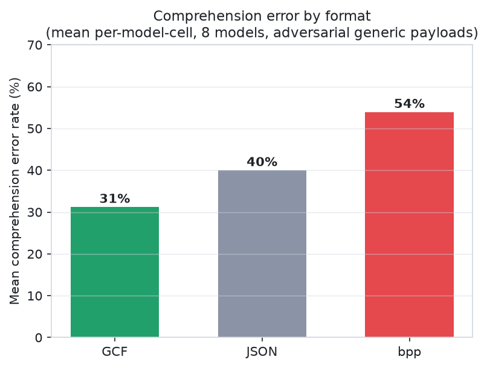
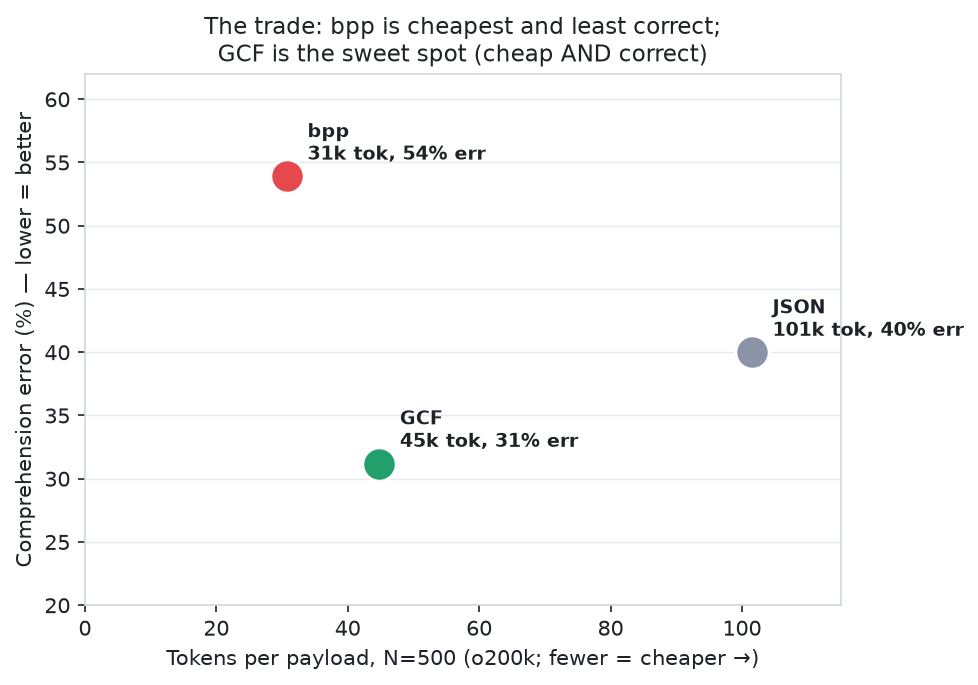
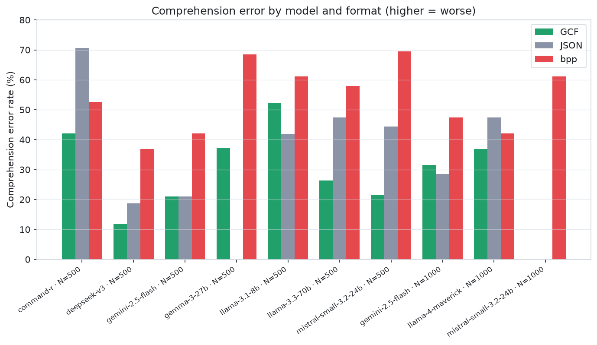

# bpp vs GCF vs JSON: Adversarial Generic-Profile Comprehension Study

_Dayna Blackwell, 2026-09-30. Does bpp's token saving survive comprehension at scale, or does its whitespace grammar and reference table degrade structural reading?_

## Scope

- **Models:** 8 across 5 families (Cohere, DeepSeek, Google, Meta, Mistral)
- **Runs:** 23  |  **Requests (payloads sent):** 1,311
- **Records evaluated:** **769,500** order-records read by models (each request carried a full 500- or 1,000-record payload), ≈ **13M** leaf field values
- **Graded responses (accuracy sample size):** 1,159 individual question judgments
- **Scales:** 500 and 1000 nested order records  |  **Questions:** 19 (13 canonical + 6 deep lookups)  |  **temp 0.2**
- **Formats:** gcf, json, bpp (bpp = refs=True, its shipping default). All presented COLD (format-name label only, no syntax primer), identical treatment.

## Result

**Mean per-model-cell error rate** (equal weight per model-cell, GCF's canonical method; avoids over-weighting the models with more repeat runs):

| format | mean cell error | vs GCF |
|---|---|---|
| **gcf** | **31.2%** | baseline |
| json | 40.0% | 1.28x |
| **bpp** | **53.9%** | **1.73x** |

_Pooled by data point (secondary; over-weights llama-3.1-8b at n=8): gcf 38.7% / json 40.4% / bpp 59.0% -> bpp 1.52x gcf._

GCF has the lowest error rate by both methods, roughly half bpp's.

## Per-model results (accuracy% / error%)

| model | family | N | runs | gcf | json | bpp |
|---|---|---|---|---|---|---|
| command-r | Cohere | 500 | 1 | 58/42 | 29/71 | 47/53 |
| deepseek-v3 | DeepSeek | 500 | 1 | 88/12 | 81/19 | 63/37 |
| gemini-2.5-flash | Google | 500 | 1 | 79/21 | 79/21 | 58/42 |
| gemma-3-27b | Google | 500 | 5 | 63/37 | n/a | 32/68 |
| llama-3.1-8b | Meta | 500 | 8 | 48/52 | 58/42 | 39/61 |
| llama-3.3-70b | Meta | 500 | 1 | 74/26 | 53/47 | 42/58 |
| mistral-small-3.2-24b | Mistral | 500 | 2 | 78/22 | 56/44 | 31/69 |
| gemini-2.5-flash | Google | 1000 | 2 | 68/32 | 71/29 | 53/47 |
| llama-4-maverick | Meta | 1000 | 1 | 63/37 | 53/47 | 58/42 |
| mistral-small-3.2-24b | Mistral | 1000 | 1 | n/a | n/a | 39/61 |

(cells are accuracy / error, pooled across that cell's runs. `n/a` = provider rejected the large payload for that format, not a comprehension result.)

## Key findings

1. **GCF lowest error in every pooling; best-or-tied in nearly every cell.** bpp had the worst error rate in almost all cells.

2. **The failure is the reference table.** bpp hoists repeated values to a top `&N` dictionary and points to them with `*N`. Models return the pointer instead of the value: `"375"`/`"749"` (the index) on capable models, `"*250"`/`"*256"`/`"*322"`/`"*372"` (the literal token) on weaker ones. GCF and JSON carry the value in place and cannot produce this.

3. **Capacity masks the damage, it does not remove it.** The delimiter-merge is a tokenizer property applied to every model identically, before inference. Stronger models spend reserve capacity reconstructing the smeared structure; they still bleed (gemini-2.5-flash lost 21 points on bpp at N=500, 58 vs 79 on a comfortable payload) and the masking erodes as payload grows (68% at N=1000). There is no 'frontier-safe' regime, only a frontier-masked one. 8b->70b lifted GCF's mean accuracy +26 points (47.8% -> 73.7%) but barely moved bpp (38.8% -> 42.1%), and the 70b still returned raw `*N` (`*256`, `*322`, `*372`). Note: 8b mean is over 8 runs, 70b is n=1.

4. **Token economics: the saving is erased once errors are priced.** bpp saves ~13k tokens/call vs GCF; one retried wrong answer re-sends ~27k (~2x the saving). bpp's extra error rate means ~1 extra wrong answer per ~5 calls, eating ~40-50% of the saving in retries alone, and silent errors (confident wrong value) are never retried, so the saving is simply spent on being wrong.

## Caveats

- **Run-count imbalance:** llama-3.1-8b n=8, gemma-3-27b n=5, gemini-1000 n=2, rest n=1-2. Headline uses mean-of-cells to neutralize this; pooled shown as secondary.

- **Provider failures (not comprehension):** cheap OpenRouter providers rejected the largest payloads on some cells (gemma json @500, mistral-small gcf+json @1000: context caps / empty responses). Those format-cells are `n/a`, excluded from rates.

- **Excluded run:** mistral-nemo (12B) was run and DELETED as sub-floor (failed order_count on all three formats; the model cannot read any format, so the run measured incompetence, not legibility). Stated criterion, not a silent drop.

- **max_tokens=200** truncated verbose chain-of-thought on a few aggregation answers (both bpp and json); affects the shared-noise aggregation questions, not the short-answer lookups.

- **Repeatability:** where repeated, bpp is highly stable (gemma 31.6% x5; mistral-small 31.6/29.4%), so the gap is not run-to-run noise.

## Conclusion

GCF has the lowest comprehension error of the three formats, on every model tier, and about half bpp's. bpp's grammar degrades structural reading everywhere, not only on weak models, so for a tool serving unknown models or non-trivial payloads a token count is the wrong basis for the choice.

## Artifacts

- `results.csv`: per-run machine-readable data
- `logs/`: raw per-run PASS/FAIL logs (expected vs got, every cell)
- `encodings/`: exact payloads per format
- `NOTES.md`: running lab notebook (method, mechanism, token economics)

## Charts

Dark variants: `charts/*-dark.png`. Regenerate all: `python3 scripts/charts.py` (reads `results.csv`).
