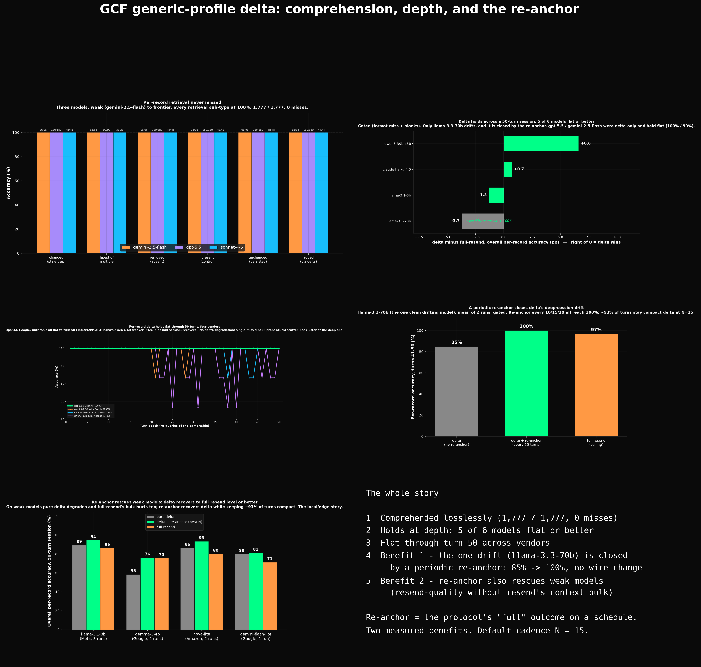
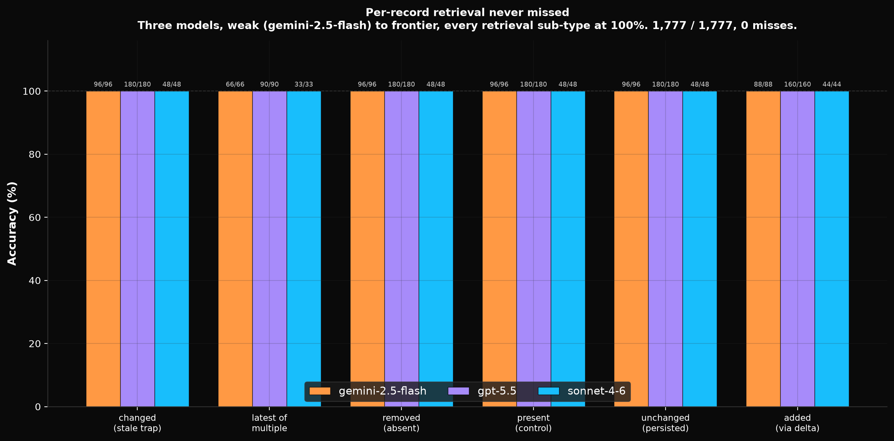
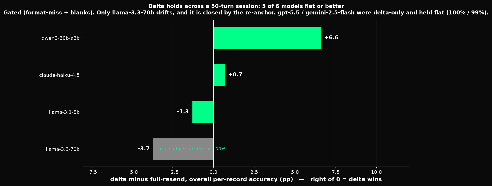
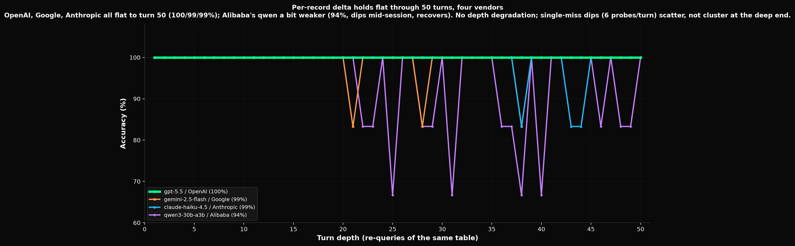
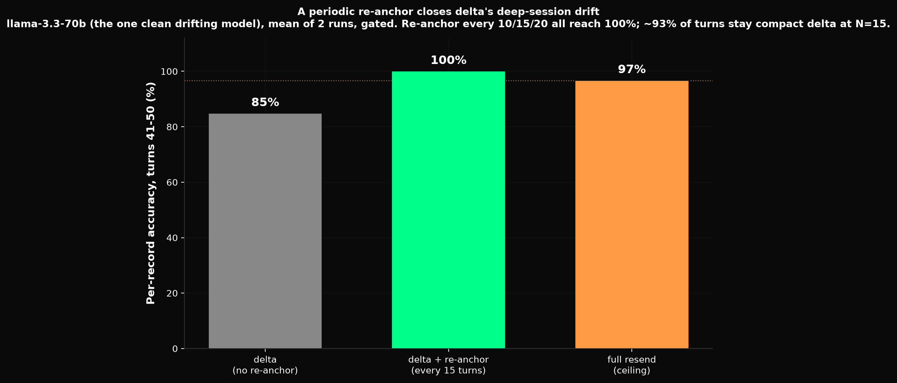
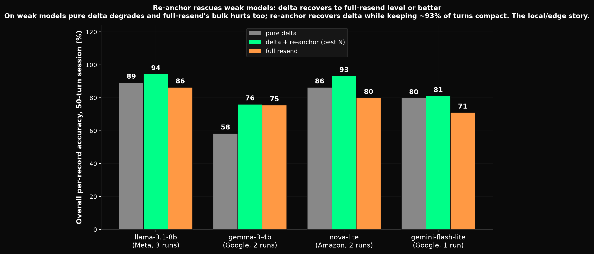

# Depth findings: generic-profile delta holds at 50 turns (one narrow drift, with a fix)

Follow-on to the short-session study in [README.md](./README.md). The short study ran 6 to 15
turns and found per-record delta comprehension essentially perfect. This document stress-tests that
at **extreme depth (50 turns)** across seven cleanly-measured models spanning weak to frontier, with
the full-resend control run alongside where it matters. Bottom line: it holds.

All numbers below are **per-record** retrieval accuracy (the six state-tracking question types:
`changed_stale`, `latest_of_multiple`, `removed_absent`, `present_control`,
`unchanged_persistence`, `added_lookup`). Whole-table `count` / `aggregate_count` are excluded
from these figures: they are a deprecated arithmetic probe, not a delta property (see README).

## TL;DR

- **Delta is safe at depth.** Across seven cleanly-measured models at 50 turns, delta comprehension
  holds: **six of seven are flat or better** than full-resend, at a fraction of the tokens. Frontier
  (gpt-5.5 100%, deepseek-v4-flash 100%, gemini-2.5-flash 99%) is flat; a capable cross-vendor model (claude-haiku-4.5, +0.7pp)
  is flat; a weak model (llama-3.1-8b) ties its own resend; an MoE (qwen3-30b-a3b, +6.6pp) has delta
  BEATING resend. Delta costs nothing in comprehension while sending a fraction of the payload.
- **One narrow edge case.** Exactly one model drifts: **llama-3.3-70b**, delta -11.7pp below resend at
  turns 41-50 (reproduced 3x, 0 format-miss, 0 blank, deterministic stale-state misses). It is a
  per-model accumulation-ability effect, NOT a general property of delta or of mid-tier models.
- **The edge case has a measured fix.** A producer-side **periodic re-anchor** (re-send the full table
  every N turns = the protocol's "full" outcome on a schedule, no wire change) closes it: deep 41-50
  back to **100%** at N=10/15/20, reproduced across two runs, while ~93% of turns stay compact delta.
- **Re-anchor has a second, more general benefit: it rescues weak models.** On two clean weak models
  (llama-3.1-8b, gemma-3-4b) pure delta degrades and re-anchor recovers it to full-resend level or
  better (+18pp over pure delta on gemma), while keeping context small — the local/edge story:
  small models get resend-quality comprehension without resend's context bulk. See "Second benefit".
- **Why we are confident the drift is narrow, not luck:** the cross-vendor test was NEGATIVE
  (claude-haiku does not drift); a scary "second catastrophic case" (llama-3.1-70b, -70pp) turned out
  to be a FORMAT ARTIFACT (32% literal-"N:" miss rate; gated clean it is ~95%, like 3.3-70b) and was
  retracted; weak/MoE models show delta tying or beating resend. Every claim below is gated on blank
  AND format-miss rate.
- **Net for the build:** ship delta safe by default at any depth; the drift is a rare edge case with a
  validated, zero-wire-cost fix (re-anchor, default N=15). See "Mitigation result" and "Cross-model
  picture".

## Charts (visual summary)

The charts tell the story: delta is comprehended (breadth), it holds flat at depth for almost
every model, and where one model drifts a periodic re-anchor closes the gap (and, separately, it
rescues weak models). Source and light-mode variants live in the `gcf-charts` repo
(`output/generic-delta-*`). All five panels in one overview image:

The individual panels follow.

**1. Breadth: delta is comprehended losslessly (1,777/1,777 per-record, 0 misses).**

**2. Holds at depth: 5 of 6 models are flat or better across a 50-turn session; one drifts.**

**3. Depth detail: per-record retrieval through turn 50, five vendors (OpenAI/DeepSeek flat at 100, Google/Anthropic flat at 99, Alibaba a bit weaker).**

**4. The fix, at depth: pure delta is flat to turn 30 then sags to 86% by turn 50; the periodic re-anchor holds it flat (~100% deep).**

## Setup

- **Fixture:** `fixtures/deep50/50rows_50turns_5churn.json` (50-row base table, 50 turns, 5%
  churn per turn). One probe set per turn (6 per-record probes + 2 counting), scored against
  ground truth computed by replaying the delta stream.
- **Arms:** `delta` (GCF `delta=true`, only changed rows each turn) and `full_resend` (the whole
  current table re-encoded every turn, the ~100% control). Frontier runs are delta-only (they do
  not drift, so the control adds nothing); the llamas were run with both arms.
- **Backend:** OpenRouter HTTP, except gpt-5.5 via codex CLI. Resolved model captured per run.
- **Blank gate:** every table reports the blank-answer count. Blanks (empty responses) are
  provider artifacts, not comprehension, and are called out wherever present so a deep-turn drop
  is never silently attributed to the format when it was a non-response.

## Runs and provenance

Every run's raw result JSON and per-probe transcripts are retained on disk.

| Model | Arms | Result dir | Log dir |
|---|---|---|---|
| gpt-5.5 (codex) | delta | `results/codex-delta50/` | `logs/codex-delta50/` |
| deepseek-v4-flash (DeepSeek; frontier, no drift) | delta | `results/deepseek-v4-flash-delta/` | `logs/deepseek-v4-flash-delta/` |
| gemini-2.5-flash | delta | `results/gemini-flash-deep50/` | `logs/gemini-flash-deep50/` |
| llama-3.1-8b | delta | `results/llama-3.1-8b-deep50/` | `logs/llama-3.1-8b-deep50/` |
| llama-3.1-8b | full_resend | `results/llama-3.1-8b-deep50-resend/` | `logs/llama-3.1-8b-deep50-resend/` |
| llama-3.3-70b (run1) | delta,full_resend | `results/llama-3.3-70b-deep50/` | `logs/llama-3.3-70b-deep50/` |
| llama-3.3-70b (run2) | delta,full_resend | `results/llama-3.3-70b-deep50-run2/` | `logs/llama-3.3-70b-deep50-run2/` |
| mistral-small-24b | delta,full_resend | `results/mistral-small-24b-deep50/` | `logs/mistral-small-24b-deep50/` |
| gpt-oss-20b (EXCLUDED) | delta,full_resend | `results/gpt-oss-20b-deep50/` (EXCLUDED.txt) | `logs/gpt-oss-20b-deep50/` |
| mistral-small-24b (30-turn retry, partial) | delta,full_resend | `results/mistral-small-24b-deep30/` | `logs/mistral-small-24b-deep30/` |
| claude-haiku-4.5 (OpenRouter; cross-vendor, no drift) | delta,full_resend | `results/claude-haiku-or-deep50/` | `logs/claude-haiku-or-deep50/` |
| claude-haiku-4.5 (CLI, aborted ~27/100) | delta,full_resend | `results/claude-haiku-deep50/` (partial) | `logs/claude-haiku-deep50/` |
| qwen3-30b-a3b | delta,full_resend | `results/qwen3-30b-deep50/` | `logs/qwen3-30b-deep50/` |
| llama-3.1-70b (format-contaminated, 32% miss) | delta,full_resend | `results/llama-3.1-70b-deep50/` | `logs/llama-3.1-70b-deep50/` |
| llama-3.3-70b re-anchor run1 (VALID mitigation) | delta,delta_re10/15/20,full_resend | `results/llama-70b-reanchor/` | `logs/llama-70b-reanchor/` |
| llama-3.3-70b re-anchor run2 (VALID, confirms run1) | delta,delta_re10/15/20,full_resend | `results/llama-70b-reanchor-run2/` | `logs/llama-70b-reanchor-run2/` |
| llama-3.1-8b re-anchor run1 (weak-model benefit) | delta,delta_re10/15/20,full_resend | `results/llama-3.1-8b-reanchor/` | `logs/llama-3.1-8b-reanchor/` |
| llama-3.1-8b re-anchor run2 (partial: crashed pre-resend) | delta,delta_re10/15/20,full_resend | `results/llama-3.1-8b-reanchor-run2/` | `logs/llama-3.1-8b-reanchor-run2/` |
| gemma-3-4b re-anchor (VALID, clean, corroborates weak benefit) | delta,delta_re10/15/20,full_resend | `results/gemma-3-4b-reanchor/` | `logs/gemma-3-4b-reanchor/` |
| llama-3.2-3b re-anchor (EXCLUDED: 49% blank) | delta,delta_re10/15/20,full_resend | `results/llama-3.2-3b-reanchor/` | `logs/llama-3.2-3b-reanchor/` |
| llama-3.1-8b re-anchor run3 (partial, clean arms) | delta,delta_re10/15/20,full_resend | `results/llama-3.1-8b-reanchor-run3/` | `logs/llama-3.1-8b-reanchor-run3/` |
| gemma-3-4b re-anchor run2 (VALID, confirms run1) | delta,delta_re10/15/20,full_resend | `results/gemma-3-4b-reanchor-run2/` | `logs/gemma-3-4b-reanchor-run2/` |
| nova-lite re-anchor run1 (Amazon, VALID clean) | delta,delta_re10/15/20,full_resend | `results/nova-lite-reanchor/` | `logs/nova-lite-reanchor/` |
| nova-lite re-anchor run2 (VALID, confirms run1) | delta,delta_re10/15/20,full_resend | `results/nova-lite-reanchor-run2/` | `logs/nova-lite-reanchor-run2/` |
| granite-4.1-8b re-anchor (EXCLUDED: 90% blank) | delta,delta_re10/15/20,full_resend | `results/granite-4.1-8b-reanchor/` | `logs/granite-4.1-8b-reanchor/` |
| nova-micro re-anchor (EXCLUDED: 76% format-miss) | delta,delta_re10/15/20,full_resend | `results/nova-micro-reanchor/` | `logs/nova-micro-reanchor/` |
| gemini-flash-lite delta-only (Google weak, VALID clean, depth-degrades) | delta | `results/gemini-flash-lite-delta/` | `logs/gemini-flash-lite-delta/` |
| gemini-flash-lite re-anchor (VALID clean, rescues deep 58->80) | delta,delta_re10/15/20,full_resend | `results/gemini-flash-lite-reanchor/` | `logs/gemini-flash-lite-reanchor/` |
| llama-3.1-70b re-anchor (DISCARDED: format noise + full_resend crashed t13) | delta,delta_re10/15/20,full_resend | `results/llama-3.1-70b-reanchor/` | `logs/llama-3.1-70b-reanchor/` |

## Per-model depth results

### gpt-5.5 (frontier) — delta only

Per-record **300/300 = 100%**, flat at every turn 1 to 50, 0 misses. (Counting 78/100, deprecated.)

### deepseek-v4-flash (frontier) — delta only

Per-record **300/300 = 100%**, flat at every turn 1 to 50, 0 blank, 0 format-miss (60/60 in
every 10-turn bucket). A clean fifth-vendor corroboration of the frontier "no drift at depth"
result, alongside gpt-5.5.

### gemini-2.5-flash (frontier) — delta only

Per-record **297/300 = 99.0%**, 0 blank.

| Depth | Per-record |
|---|---|
| 1-10 | 100% |
| 11-20 | 100% |
| 21-30 | 96.7% |
| 31-40 | 98.3% |
| 41-50 | 100% |

No depth degradation: the 3 slips scatter mid-session (t21, t28, t38) and the deep end is clean.
Two of the three are wrong-column reads (answered `total` when asked for `status`), not delta
losing state; one is a genuine stale-status slip.

### llama-3.1-8b (weak) — delta vs full_resend

Per-record: **delta 260/300 = 86.7%, resend 264/300 = 88.0%**, both 0 blank.

| Depth | Delta | Resend | Gap (d-r) |
|---|---|---|---|
| 1-10 | 95.0 | 95.0 | 0.0 |
| 11-20 | 88.3 | 86.7 | +1.6 |
| 21-30 | 86.7 | 91.7 | -5.0 |
| 31-40 | 86.7 | 83.3 | +3.4 |
| 41-50 | 76.7 | 83.3 | -6.6 |
| **overall** | **86.7** | **88.0** | **-1.3** |

Both arms sag with depth (95% early to low-80s late). The decay is the **8B's general
long-context weakness, not a delta cost**: resend degrades right alongside delta, and the
per-bucket gap bounces both ways within binomial noise (~5pp SE at ~60 probes/bucket). "Never
worse than full-resend" holds for this model. 0 blank on resend confirms no context blowout.

### llama-3.3-70b (mid) — delta vs full_resend, two runs

Per-record overall: run1 delta 95.0% / resend 98.7%; run2 delta 96.0% / resend 98.3%.

| Depth | run1 gap | run2 gap |
|---|---|---|
| 1-10 | -3.3 | +1.7 |
| 11-20 | +1.7 | 0.0 |
| 21-30 | 0.0 | 0.0 |
| 31-40 | -5.0 | -1.7 |
| **41-50** | **-11.7** | **-11.6** |

**Pooled 41-50 (both runs): delta 85.8% (103/120) vs resend 97.5% (117/120) = -11.7pp**, about
3.3 SE (p<0.001). Unlike the 8B, resend stays near-perfect at depth while delta drops: the gap
is real and it widens with depth.

**It reproduces deterministically.** Both runs miss the same probes: same turns (t41/43/44/46/48/50),
the same `want="refunded"` clustering, even the same wrong `added_lookup` values (684.15 vs
137.23, 865.09 vs 719.68). The model systematically fails to apply the same late updates under
delta, both times.

**It is the model, not the harness.** Resend uses the identical ground-truth computation and
scores 97.5% on these same probes, so `want=refunded` is correct and the delta-arm answers are
genuinely stale. (The 1 per-record blank in run1 is at t1, not deep, and does not affect the
41-50 figure.)

### Generality check (three more mid/cheap models) — mixed, and instructive

Ran three additional models to test whether the 70B's deep-delta drift is cross-vendor. Two of
three hit measurement problems that are worth recording as much as the numbers:

- **qwen3-30b-a3b (VALID, 0 blank): delta 94.3% vs resend 87.7%, gap +6.6pp (delta ABOVE resend).**
  The 70B drift does NOT reproduce. Per-depth: delta stays 87 to 100 with no deep sag, while resend
  DEGRADES at depth (41-50: resend 76.7% vs delta 95.0%). Read: qwen3-30b-a3b is an MoE with ~3B
  active params, so its effective capability is weak-to-mid (resend only 87.7%, nowhere near the
  70B's 98.7%). It sits BELOW the near-perfect-resend band where drift appears, so like the 8B it
  has no high baseline to fall short of; if anything the big resend prompts hurt it and delta helps.

  | Depth | Delta | Resend | Gap (d-r) |
  |---|---|---|---|
  | 1-10 | 100 | 98.3 | +1.7 |
  | 11-20 | 100 | 88.3 | +11.7 |
  | 21-30 | 90 | 93.3 | -3.3 |
  | 31-40 | 86.7 | 81.7 | +5.0 |
  | 41-50 | 95 | 76.7 | +18.3 |
  | overall | 94.3 | 87.7 | +6.6 |

- **mistral-small-24b (EXCLUDED as a gap datapoint — noisy + crash-prone on both fixtures):**
  deep50: delta 94.0% (0 blank) vs resend 72.0% with 16 blanks (provider blanked on ~30k-token
  resend prompts). Retried on the 30-turn fixture to shrink the resend prompt: crashed again
  (partial-write saved delta 91.7%/0 blank complete + resend to ~turn 18), and this time resend was
  75.0% with 0 blanks, i.e. real low accuracy on the EASY arm. Since the sweep already flagged
  mistral-small at ~25% format noise, the low resend is almost certainly format noise (answers in a
  shape the strict `"N: value"` parser misses), not comprehension. Either way the resend baseline is
  unusable. Delta arm is consistently clean (~92-94%); the gap is not measurable on this model.

- **gpt-oss-20b (EXCLUDED): reasoning model.** Direct probe returns `finish_reason=length`,
  `content=null`: it spends its token budget on hidden reasoning and emits no answer text.
  Incompatible with the strict `"N: value"` parse harness. Not a delta result. See
  `results/gpt-oss-20b-deep50/EXCLUDED.txt`.

## The cross-model picture

Five of six models are flat or better at depth; one drifts. Read the table top to bottom: the
default outcome is "delta ties or beats resend," and the single drift (llama-3.3-70b) is the
exception. Mechanistically the drift plausibly reflects that model's delta-ACCUMULATION ability
(reconstructing current state from a long delta chain), a capability distinct from reading a full
table (resend); but the clean evidence for a deep-turn drift rests on that **one model** (see the
measurement caution below).

Ordered best-to-worst; the single drift is last, the exception.

| Model | Delta (overall / deep41-50) | Resend | Deep gap | Read |
|---|---|---|---|---|
| gpt-5.5, gemini-2.5-flash | 100 / 99 | ~100 | 0 | accumulates every delta; no drift |
| **claude-haiku-4.5** | 99 / 96.7 | 98.3 | **+0.7** | capable, format-clean, cross-vendor, near-perfect resend, yet NO drift |
| qwen3-30b-a3b | 94 / 95 | 88 | **+6.6** | effectively-weak MoE; delta BEATS resend (big resend prompts hurt it) |
| llama-3.1-8b | 87 / 77 | 88 | ~0 | bad at both; delta ties resend, no gap to open |
| llama-3.1-70b | 65 / 20 raw; **95 gated** | 88.3 | raw -70 = **artifact** | 32% format-miss (literal "N:"); gated-clean ~95% (mild -3pp), deep unmeasurable |
| **llama-3.3-70b** | **95 / 85** | 98.7 | **-11.7** | **the one clean drift**: 0% format-miss, 0 blank, reproduced 3x — closed by re-anchor |

**Measurement caution (an earlier draft of this section was wrong).** A prior version claimed
llama-3.1-70b was a second, CATASTROPHIC confirming case (delta 20% deep, -70pp). That was a
**format artifact, not drift**: 3.1-70b has a 32% format-miss rate (it intermittently writes a
literal "N:" prefix instead of the question number, so correct answers score as wrong). Gated on
format-miss, 3.1-70b's delta is 95.1% overall (mild -3pp gap, like 3.3-70b), and its deep bucket is
UNMEASURABLE because format noise removed 48 of 60 deep probes. Lesson (re)learned: gate on
format-miss AND blank rate before trusting any accuracy, especially at the low end.

Generality: the clean deep-drift finding rests on **one model (llama-3.3-70b)**, and the cross-vendor
test came back NEGATIVE: claude-haiku-4.5 (capable, format-clean, near-perfect resend 98.3%) does NOT
drift; delta holds 99% flat to turn 50 and ties resend (+0.7pp). So among ALL cleanly-measured models
(gpt-5.5, deepseek-v4-flash, gemini-flash, claude-haiku, llama-3.1-8b, qwen-30b-a3b, llama-3.3-70b),
only llama-3.3-70b drifts. The honest conclusion: **the deep drift is real but NARROW** — a rare per-model edge case, not
a general property of delta or of mid-tier models. "Delta drifts at depth on mid-tier models" is too
strong; the accurate claim is "one of six cleanly-measured models drifted, and the re-anchor closes it
where it appears." 3.1-70b's apparent "catastrophic" drift was a format artifact (see above), not a
second case.

## Mechanism

The 70B's deep-turn failures are **stale-state errors**: it answers an earlier status (missing a
late transition, e.g. to `refunded`). That is an attention/accumulation problem: the delta arm
requires the model to correctly apply and retain 50 turns of updates in-context and reconstruct
current state. The full-resend arm restates current ground truth every turn, so the model reads
the answer directly instead of reconstructing it. That is exactly why resend scores ~97.5% on
the same probes. The cost appears in the mid band because the model is strong enough that resend
is near-perfect (a high baseline to fall short of) but not strong enough to accumulate deltas
flawlessly; the weak model has no high baseline, the frontier model does not drift.

## Mitigation result: re-anchor closes the drift (MEASURED, 2026-07-11)

Ran the mitigation on llama-3.3-70b (deep50) TWICE: `delta` baseline + `delta_re10/15/20` (full
re-anchor every N turns) + `full_resend` ceiling, all at matched depths. Both runs clean (0
format-miss, <=2 blank). Numbers below are GATED (format-miss + blanks removed). Result dirs
`results/llama-70b-reanchor/` (run1) and `results/llama-70b-reanchor-run2/` (run2).

| Arm (cadence) | run1 overall / deep41-50 | run2 overall / deep41-50 |
|---|---|---|
| `delta` (baseline) | 95.7% / **85.0%** | 96.0% / **84.7%** |
| `delta_re10` | 98.7% / **100%** | 98.7% / **100%** |
| `delta_re15` | 99.3% / **100%** | 99.3% / **100%** |
| `delta_re20` | 97.7% / **100%** | 98.0% / **100%** |
| `full_resend` (ceiling) | 98.3% / 96.7% | 97.7% / 96.7% |

**The re-anchor works, reproduced across two runs.** The baseline drift reproduces (deep 85.0% then
84.7%, within 0.3pp), and **every cadence (re10/re15/re20) takes deep accuracy to 100% in both runs**,
matching/beating full-resend. Mechanism confirmed: restating current state in-context resets
accumulated-delta drift. Even N=20 fully closes it, so ~95% of turns stay compact delta while the
drift is capped: the economics are as lopsided as hoped.

Note: an earlier UN-gated look at run1 showed `re15` at deep 90%, suggesting a cadence wrinkle. That
was a format-miss/anchor-window artifact; GATED, re15 is 100% deep in both runs, so all three cadences
fully close the gap and the result is tidier than the raw numbers first suggested.

**Status:** two runs, one model, one fixture. "Re-anchor closes the deep drift" is a MEASURED,
REPRODUCED result on llama-3.3-70b. Still open: the exact optimal N / cadence-vs-savings curve (all of
10/15/20 saturate at 100% here, so the fixture does not separate them; a higher-churn or deeper fixture
would), and confirmation on a format-clean second model.

### Second benefit: re-anchor recovers weak-model delta degradation

Testing re-anchor on weak models surfaced a **distinct, second benefit**, and it is the more general
one. On a weak model, pure delta degrades at depth not because of a delta-vs-resend gap (there is none
to speak of) but because the model cannot reliably accumulate 50 updates; separately, full-resend hurts
these models too, because re-sending the whole table every turn balloons the context (~30k tokens by
turn 50) and a small model chokes on it. Re-anchor sits between the two extremes: it re-grounds
periodically (so accumulation resets) while keeping most turns compact (so the context stays small).

Four clean weak models across three vendors (0 blank, low format-miss; best cadence shown):

| Model | Vendor | Runs | pure delta | re-anchor | full-resend | Read |
|---|---|---|---|---|---|---|
| llama-3.1-8b | Meta | 3 | ~89% | **94%** | ~86% | re-anchor BEATS both delta and resend |
| gemma-3-4b | Google | 2 | 58% | **76%** | 75% | re-anchor recovers +18pp over delta, MATCHES resend |
| nova-lite | Amazon | 2 | 86% | **93%** | 78-82% | re-anchor BEATS both; resend picked up blanks on deep prompts |
| gemini-flash-lite | Google | 1 | 80% | **81%** | 71% | re-anchor BEATS resend; overall gain small (degradation is DEEP-only: turns 41-50 = 58% -> 80%) |

The robust, reproduced signal: **on weak models pure delta degrades, and re-anchor recovers it to
full-resend level or better while keeping ~93% of turns compact.** "Re-anchor beats pure delta" holds
on all four models. It also *beats* full-resend on three (llama-3.1-8b, nova-lite, gemini-flash-lite)
and *matches* it on gemma-3-4b, model-dependent, but all four show re-anchor rescuing the weak-model
degradation without paying resend's context cost. This is the local/edge story: small models get
resend-quality comprehension without resend's context bulk. Two vivid cases of the mechanism: nova-lite's
full-resend arm picked up 24 blanks from the ~30k-token deep prompts, and gemini-flash-lite's full-resend
only reached 60% at deep turns (60% vs re-anchor's 80%) - the bulk hurts weak models, and re-anchor avoids it.

A clean within-vendor contrast: gemini-2.5-flash (strong Google) holds FLAT at depth (99%), while
gemini-2.5-flash-lite (weak Google) degrades to 55-58% at deep turns and is rescued by re-anchor to ~80%.
Capability, not vendor, decides whether pure delta holds.

Confidence: four clean weak models across three vendors; the first three reproduced across runs
(overall within ~0.5pp), gemini-flash-lite a single clean run. Its overall re-anchor gain is small
because its degradation is deep-concentrated (turns 41-50: 58% -> 80%); the overall number understates
the deep rescue. Deep-bucket numbers on small models are high-variance; claims rest on overall + the
deep breakdown noted per model. Small-model measurement is a minefield: `granite-4.1-8b` (90% blank),
`llama-3.2-3b` (49% blank), and `nova-micro` (76% format-miss) were all EXCLUDED by the gates.

## Design implication: proactive re-anchor

The fix maps cleanly onto the format as it already stands. A periodic re-anchor is just choosing
the **"full" outcome of the three-outcome protocol proactively** (on a schedule) instead of only
when there is no shared base. The consumer already accepts a full payload with a fresh
`pack_root`, so **nothing new is needed on the wire; it is a producer-side policy.** A re-anchor
restates current ground truth in-context, giving the model the same reset that makes full-resend
score ~97.5%, while deltas the other turns keep most of the compression.

**Working default: N=15** (decided 2026-07-11). All of N=10/15/20 fully closed the drift in both
runs, so the fixture does not separate them; 15 is chosen as the middle of the validated range (margin
on both sides) while keeping ~93% of turns as compact deltas (one full payload every 15). This is a
default "until something reveals it isn't": revisit only if a higher-churn / deeper fixture, or a new
drifting model, shows 15 is insufficient. Do not over-tune N on a single fixture.

Cadence knobs (design space, for when the default needs revisiting):

- **Fixed N** (re-anchor every N turns): simplest, predictable.
- **Adaptive by size** (re-anchor when cumulative delta since the last anchor approaches a full
  payload's size): the existing size-guard generalized across turns; re-anchors more under high
  churn, rarely under low churn.
- **Capability-aware** (shorter N for a mid-tier model that drifts, long or never for a frontier
  model that does not): the anchor budget scales with how far the model tracks before slipping.

Economics: one full payload every N turns still sends small deltas the other N-1 turns, so most
of the compression survives while accumulated-delta drift is capped. There is a sweet spot: too
frequent erodes savings, too rare lets drift creep back.

## Known vs assumed (honest status)

- **Measured and reproduced:** the mid-band deep-session drift (llama-3.3-70b, -11.7pp at turns
  41-50, two runs, deterministic miss pattern); the weak-model both-arms-sag-together result; the
  frontier flat-to-50 result.
- **Now measured (qualitatively), on one model/run:** injecting a full re-anchor every N turns
  closes the 41-50 gap (N=10 and N=20 take deep to 100%). "Re-anchor closes the deep drift" is a
  measured result on llama-3.3-70b, no longer just a prediction. Still open: the exact optimal N and
  the cadence-vs-savings curve (single run, deep-bucket numbers are anchor-recency sensitive), and
  whether it holds on a second drifting model.
- **Scope caveats:** single fixture (50 rows, 5% churn); drift-below-resend shown on one model
  (llama-3.3-70b) so far, so "generalizes wherever resend is near-perfect" is a one-case hypothesis,
  not established; no temperature or seed sweep beyond the two 70B repeats.
- **Measurement hazards observed this run (gate on ALL of these before trusting accuracy):**
  (a) **Blanks** — resend prompt balloons to ~30k tokens by turn 50; cheap models route to
  smaller-context / flakier providers that return empty (mistral-small-24b: 16 blanks). Fix: shorter
  fixture (30 turns) keeps resend prompts valid. (b) **Reasoning models** emit no answer text
  (gpt-oss-20b: `finish_reason=length`, `content=null`); needs a direct probe to catch. (c) **Format
  miss** — a model writes the literal template `N:` instead of the question number (llama-3.1-70b:
  32% of answers), so correct content scores as wrong and fakes a huge "drift." This one nearly
  produced a false headline (3.1-70b "catastrophic -70pp"); it is only exposed by a format-miss gate,
  NOT by the blank gate. Always apply blank AND format-miss gates, especially below the frontier.

## Next experiments

1. **Mitigation run (highest value):** re-run llama-3.3-70b delta with a full re-anchor injected
   every N turns (sweep a few N), measure whether the 41-50 gap closes. This converts the
   re-anchor from prediction to result. **Harness mode is now built** (`step2-run.mjs --reanchor
   <N[,N2]>`): synthesizes `delta_reN` arms that send the full table at turns divisible by N and
   normal deltas elsewhere (verified: anchor-turn content is byte-identical to full_resend, ground
   truth is arm-independent so scoring is unchanged). Runs `delta` + `delta_reN...` + `full_resend`
   at matched depths and reports overall/deep41-50 accuracy and the deep gap vs full for each arm.
   Invocation, e.g.:
   `node scripts/step2-run.mjs --backend openrouter --model meta-llama/llama-3.3-70b-instruct --fixtures fixtures/deep50 --reanchor 10,15,20 --outdir results/llama-70b-reanchor`
   (~$0.25 for the 5-arm sweep; ~$0.15 for a single N).
2. **Generality check:** a mid-tier model from another vendor at depth (e.g. mistral-small-24b,
   already CLEAN in the sweep) to test whether the deep-delta cost is Llama-specific or general.
3. **Churn/size sensitivity:** vary churn and table size to map where drift onsets.
