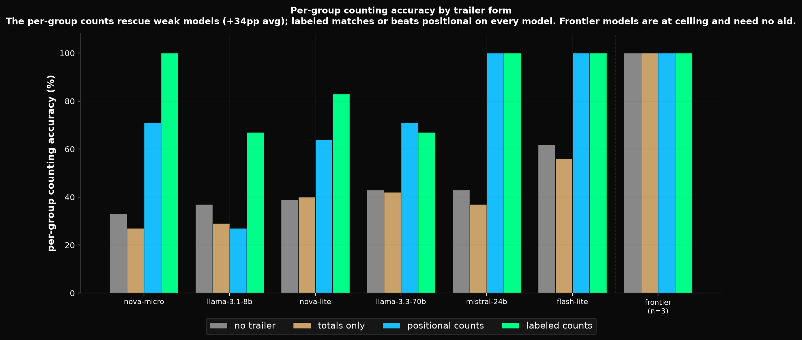
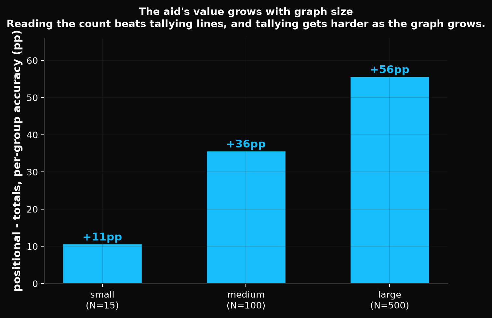

# Findings: graph streaming-trailer per-group counts

**Question.** In graph streaming, the `##! summary` trailer reports a per-group count list
(`counts=2,1,3` for targets/related/edges). All six SDKs emit this; no decoder validates it
(the graph decoder ignores trailer counts entirely), so it is purely an LLM comprehension aid.
Prior comprehension evals used buffered payloads, so this aid had never been measured. Does it
help counting-task comprehension, and is a **labeled** form better than the shipped **positional** one?

This settles the open item in `SPEC.md` §8.4 and `ROADMAP.md` ("Streaming trailer, per-group counts").

## Method

Four arms on an **identical graph**, differing only in the trailer (and a one-paragraph primer
describing that trailer honestly): `none` (no trailer), `totals` (`symbols=N edges=M`),
`positional` (`counts=2,1,3`, the shipped form), `labeled` (`counts=targets:2,related:1,edges:3`).
Per-group counting questions ("how many symbols in the related group?", group diff/sum) plus totals
and control (symbol lookup) questions, with programmatic ground truth. Three graph sizes
(N=15 / 100 / 500), two seeds each. Comp-only scoring (credits format-misses), blank-rate gate
(>=5% empty answers excludes a model as a non-response artifact). See `README.md`. Backends:
codex CLI, claude CLI, and OpenRouter HTTP; runs are resumable, retry with backoff, and every
transcript is committed under `logs/`.

## Result

Per-group counting accuracy by arm (comp-only, blank-gated):

| tier | model | runs | none | totals | positional | labeled | positional−totals (±SD) | labeled−positional |
|------|-------|------|------|--------|------------|---------|--------------------------|--------------------|
| capable | codex (default) | 1 | 100 | 100 | 100 | 100 | +0 | +0 |
| capable | claude-haiku-4.5 | 1 | 100 | 100 | 100 | 100 | +0 | +0 |
| capable | claude-sonnet-4.6 | 1 | 100 | 100 | 100 | 100 | +0 | +0 |
| mid | gemini-2.5-flash-lite | 3 | 62 | 56 | 100 | 100 | +44.4 ±1.9 | +0 |
| mid | mistral-small-3.2-24b | 3 | 43 | 37 | 100 | 100 | +63.3 ±0.0 | +0 |
| mid | llama-3.3-70b | 3 | 43 | 42 | 71 | 67 | +28.9 ±10.2 | −4 |
| weak | nova-lite-v1 | 3 | 39 | 40 | 64 | 83 | +24.4 ±16.8 | +19 |
| weak | nova-micro-v1 | 3 | 33 | 27 | 71 | 100 | +44.4 ±3.8 | +29 |
| weak | llama-3.1-8b | 3 | 37 | 29 | 27 | 67 | −2.2 ±3.8 | +40 |
| (excluded) | ministral-3b | 3 | 3 | 21 | 58 | 94 | (24% blank — EXCL) | |

**Clean aggregate (6 non-excluded OpenRouter models):** `positional−totals` **+33.9pp**,
`labeled−positional` **+13.9pp**, `totals−none` −4.6pp. By size: small +10.6pp, medium +35.6pp,
**large +55.6pp**. Non-reasoning instruct models only (reasoning models sit at ceiling and are
uninformative for a format-aid question; they were excluded by design, not tested).

(A qwen-2.5-7b run was attempted but its OpenRouter runs crashed partway under concurrent
load — rate-limited, crash-partial — and could not be re-run cleanly, so it is not included.)





(Charts generated by `gcf-charts/charts.py`: `trailer-counts-by-arm`, `trailer-counts-by-size`.)

## Conclusions

**1. The per-group counts earn their tokens where it matters.** On weak/mid models the per-group
counts add ~+34pp on per-group counting, and the effect grows sharply with graph size (+11pp at
N=15 to +56pp at N=500) — the mechanism is "read the count vs tally 250 lines." At the frontier
(codex, haiku-4.5, sonnet-4.6) every model is at ceiling on all arms, including no-trailer at
N=500, so the aid is +0pp. This is the *empirical* backing for keeping the trailer counts
(the SPEC §8.4 "Option B" decision), beyond the earlier decoder-ignored / no-churn argument.

**2. Labeled ≥ positional for every model — a strict robustness improvement.** The population
splits: models that can parse the positional form ceiling on it (mistral-24b, flash-lite hit 100%,
labeled +0); models that cannot are rescued by labels (llama-3.1-8b: positional −2.2pp and 27% <
no-trailer 37%, but labeled +40pp; nova-micro +29pp, nova-lite +19pp). Labeled is never meaningfully
worse (llama-70b −4 is within noise) and sometimes decisive. The shipped *positional* `counts=2,1,3`
is an adequate aid for models that can map position→group and a failed one for models that cannot;
the *labeled* form works across the population.

**3. The blank gate mattered.** ministral-3b (3B) returned empty answers on 24% of questions,
concentrated on the large-graph prompts — a non-response artifact, not comprehension. It is
auto-excluded (same class as qwen-2.5-72b in the delta-eval sweep). Its raw numbers looked dramatic
(no-trailer 3% → labeled 94%) precisely because they are polluted; excluding it keeps the aggregate honest.

## Recommendation

- **Keep `positional` as the shipped default.** It is decoder-ignored, costs almost nothing, is
  already conformance-locked across six SDKs, and is an adequate aid for models that can parse it.
  Changing the default would be churn for no machine benefit.
- **Offer `labeled` as an opt-in producer mode** for weak/varied consumers. It is the form that
  *reliably* delivers the comprehension boost across the model population, paid for in a few label
  tokens, with zero decoder cost (the trailer counts are informational regardless of form). This
  dovetails with the `## _counts` roadmap direction (labeled per-group counts are a lightweight,
  in-trailer version of it).

## Caveats

Single-shot static payloads (the comprehension effect is about the trailer text the model reads,
not streaming timing). Six clean OpenRouter models plus three CLI-backend ceiling controls; two
seeds per size. HTTP temperature 0.2 (CIs run tight). nova-lite's SD is wide (±16.8). The
positional-vs-labeled split is a population effect, not a per-token-cost model — a producer choosing
labeled should weigh the label tokens against its consumer tier.

## Reproduce

```bash
cd eval/graph-trailer-counts
command node scripts/gen.mjs                 # fixtures (deterministic)
command node scripts/run.mjs --self-test     # validate the harness (no spend)
OPENROUTER_API_KEY=... command node scripts/sweep.mjs --model <slug> --repeats 3
command node scripts/analyze.mjs             # gated per-arm contrasts by model + size
```

All per-probe transcripts for the runs above are committed under `logs/sweep/<model>/run<k>/`.
